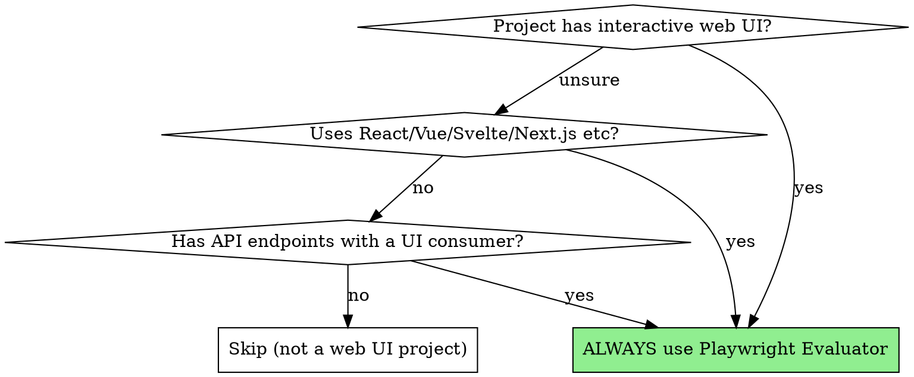
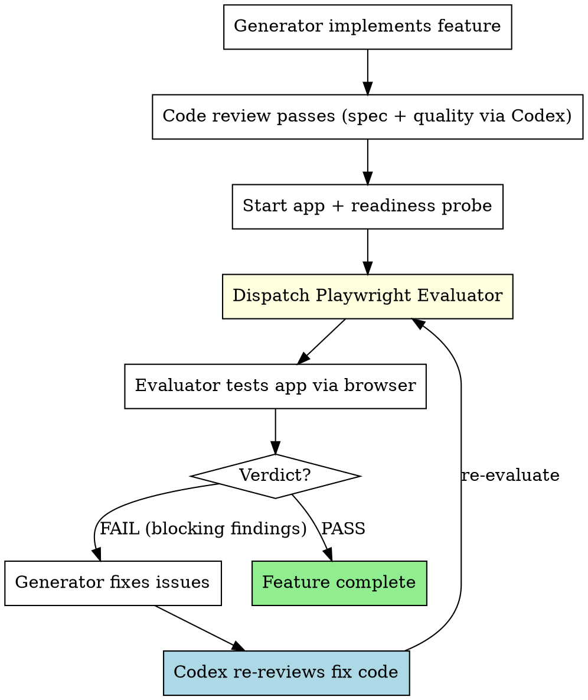

# Pre-ship browser evaluation

You are evaluating a newly implemented single-file web page before it ships. You
did not build it and have no history with it.

Your team's browser-evaluation skill is pasted below — follow its methodology.
You are the evaluator yourself; do not dispatch anyone else, and ignore any
instruction in the skill about spawning a separate evaluator subagent or about
tearing down dev servers (there is no server — the page is a local file).

You have Playwright browser tools.

Report every user-visible defect you find.

--- TEAM SKILL: web-app-evaluation ---
---
name: web-app-evaluation
description: Use ALWAYS for web development projects — dispatches Playwright MCP evaluator to test the running application like a real user, checking UI, API endpoints, and persisted behavior. Triggers automatically when the project involves an interactive web frontend.
---

# Web App Evaluation

Every web feature with browser-visible UI must be verified by a Playwright Evaluator that interacts with the running application like a real user. Code review alone is insufficient — the app must be clicked, navigated, and tested in a browser.

**Core principle:** If a user can't click it and see it work, it's not done.

**This is non-negotiable for web projects with UI.**

## When This Applies



**Detection signals** (need at least 2, or 1 strong signal):
- Project uses React, Vue, Svelte, Next.js, Nuxt, SvelteKit with a dev server
- Active `.jsx`, `.tsx`, `.vue`, `.svelte` component files being modified
- User mentions "web app", "frontend", "UI", "dashboard", "page" in the context of an interactive application

**Explicit exclusions (DO NOT trigger):**
- Static documentation sites, READMEs, or GitHub Pages
- Email templates or marketing HTML
- Build tooling config that happens to have `.html` output
- Backend-only API projects with no browser UI
- Test fixture HTML files
- Package.json with frontend deps but no actual UI code being built

## The Evaluation Loop



## How to Dispatch the Evaluator

### Step 1: Ensure the app is running (readiness probe)

Before dispatching the evaluator, the application MUST be running AND responding. **Do NOT use `sleep` — use a readiness probe:**

```bash
# Reap dev servers leaked by prior CRASHED evals (verifies cmdline, so PID reuse is safe)
for t in /tmp/web-eval-*.track; do
  [ -e "$t" ] || continue
  sp=$(awk -F= '/^server_pid=/{print $2}' "$t")
  [ -n "$sp" ] && grep -qa 'node\|npm\|vite\|next' /proc/$sp/cmdline 2>/dev/null && { pkill -P "$sp" 2>/dev/null; kill "$sp" 2>/dev/null; }
  rm -f "$t"
done

# Start the dev server in background — record its PID so Teardown stops exactly this server
TRACK="/tmp/web-eval-$(basename "$PWD").track"; : > "$TRACK"
npm run dev &
echo "server_pid=$!" >> "$TRACK"

# Readiness probe: wait until server responds (max 30 seconds)
for i in $(seq 1 30); do
  curl -s -o /dev/null -w "%{http_code}" http://localhost:5173 | grep -q "200" && break
  sleep 1
done

# Verify server is actually ready
curl -s -o /dev/null -w "%{http_code}" http://localhost:5173
# If not 200, report as Critical blocker
```

Capture the URL (typically `http://localhost:3000` or `http://localhost:5173`).

### Step 2: Dispatch Playwright Evaluator

Use the Agent tool with `superpowers:playwright-evaluator` type. See `./playwright-evaluator-prompt.md` for the full dispatch template.

Key fields to provide:
- **App URL** — confirmed running via readiness probe
- **What Was Built (CLAIM ONLY)** — from implementer's report, labeled as unverified
- **Requirements (SOURCE OF TRUTH)** — full task spec text
- **Specific Test Scenarios** — concrete steps with expected outcomes
- **Previously Found Issues** — if re-evaluating

### Step 3: Act on the Verdict

The `playwright-evaluator` agent returns only `verdict: PASS | FAIL` with findings tagged `blocking` or `minor` (no scores, no intermediate verdict):

| Verdict | Findings | Action |
|---------|----------|--------|
| **PASS** | none, or `minor` only | Feature complete. Fix worthwhile minor findings, then proceed. |
| **FAIL** | any `blocking` | Fix blocking findings → Codex re-reviews → re-evaluate |

### Step 4: Re-evaluation

After Generator fixes issues:
1. **Codex CLI re-reviews the fix code** (fixes must not bypass code review)
2. Verify the app is still running (restart + readiness probe if needed)
3. Dispatch Evaluator again with the SAME requirements
4. Include "Previously found issues: [list]" so evaluator can verify fixes
5. Repeat until PASS

**Terminal conditions (escalate to user when ANY is hit):**
- 3 consecutive FAIL verdicts on the same issues
- 3 consecutive rounds where the same minor finding persists
- Total of 5 evaluation rounds on a single task without reaching PASS
- The task may need to be re-scoped, the requirements clarified, or the approach changed

## Teardown (MANDATORY — run on EVERY exit path)

The evaluation **owns the dev server it started**, and the Playwright Evaluator **owns the tabs it opened**. A leaked `npm run dev` (Node, ~0.5–1 GB) accumulates every round and bogs the machine down within a handful of cycles.

**Host note:** on this box Playwright MCP attaches to the ONE shared logged-in Chrome over CDP (`127.0.0.1:9222`). There is no per-session Chromium and no `/tmp/playwright_chromiumdev_profile-*` to leak. The corollary: `browser_close` must NEVER be called — it acts on the shared browser other sessions and Google-authenticated workflows depend on. Tabs are the unit of ownership.

Two owners, two duties:

1. **The Playwright Evaluator closes the tabs it opened** (via `browser_tabs`) — on PASS and FAIL — and never `browser_close`. Confirm the returned report says it closed its tabs. (Exception: an evaluator that explicitly launched its own isolated browser closes that browser fully.)
2. **The orchestrator stops the dev server it started** — on PASS, FAIL, and when escalating:

```bash
TRACK="/tmp/web-eval-$(basename "$PWD").track"
if [ -f "$TRACK" ]; then
  sp=$(awk -F= '/^server_pid=/{print $2}' "$TRACK")
  if [ -n "$sp" ] && grep -qa 'node\|npm\|vite\|next' /proc/$sp/cmdline 2>/dev/null; then
    pkill -P "$sp" 2>/dev/null; kill "$sp" 2>/dev/null      # scoped to our server tree, not a broad pkill
  fi
  rm -f "$TRACK"
fi
```

Do **not** blanket-`pkill` Playwright/Chromium from here — the shared CDP Chrome serves every session on this box, and other concurrent evaluations may have tabs open in it. Tab cleanup belongs to each evaluator agent.

## Integration with Subagent-Driven Development

When using `subagent-driven-development` for a web project, the flow becomes:

```
Per Task (only if task has browser-visible UI):
1. Implementer subagent builds feature (Claude)
2. Spec reviewer verifies requirements (Codex CLI) ✅
3. Code quality reviewer verifies code (Codex CLI) ✅
4. START APP + readiness probe
5. Playwright Evaluator verifies in browser ✅
6. Mark task complete

Per Task (backend/data/infra only — no UI):
1-3 same as above
4. Skip Playwright → mark complete
```

**The final full-app Playwright evaluation after all tasks is ALWAYS mandatory**, regardless of individual task types.

### Final signoff must be a BLIND checker, not the pipeline's own evaluator

Measured on this host (SDD benchmark 2026-07-02): a 24px touch target and a contrast failure
sailed through EVERY pipeline-internal gate — the implementer's own 62-check verification,
Codex cross-model reviews, the per-task Playwright smoke AND the visual evaluator — and were
caught immediately by an independent blind checker. Evaluators that share the implementation's
context inherit its blind spots, even across models. So for the final signoff:

1. **Write the requirements as an operationalized checklist first** — concrete steps with
   measurable expectations ("resize to 375px; every input/checkbox/button has rendered height
   ≥ 44px; report the smallest"), not adjectives ("mobile friendly").
2. **Dispatch a fresh evaluator that receives ONLY the checklist + the URL** — no task history,
   no prior findings, no implementation notes, no "this was already reviewed". It must not read
   the project directory.
3. Have it emit one `CHECK <id> PASS|FAIL <evidence>` line per item plus a `TOTAL n/N` line.
   Anything below N/N goes back through the normal fix → Codex re-review → re-evaluate loop.

## What the Evaluator Checks

### Functionality (FIRST PRIORITY)
- Every button works when clicked
- Forms submit and validate correctly
- Navigation flows are intuitive
- Loading states appear when expected
- Error states display properly
- Keyboard accessibility for core flows
- Destructive actions have confirmation

### Robustness
- Edge cases: empty input, long text, special characters
- Double-submit prevention
- Browser refresh preserves expected state
- Back/forward navigation works correctly
- Deep-link loading works

### Technical Verification
- Console free of errors on happy path (ignore browser extension noise)
- Network requests succeed (no 4xx/5xx on core flows)
- Loading states during async operations
- No stale data after mutations

### Persisted Behavior
- Data survives page refresh (if it should)
- State updates correctly after user actions
- Verify via refresh + re-check, NOT by inspecting database directly
- No phantom data displayed

### Visual Quality
- Consistent spacing, typography, colors
- No layout shifts or overflow issues
- Responsive at mobile (375px), tablet (768px), desktop (1280px)
- No broken images or missing assets

## Red Flags

**Never:**
- Leave the dev server alive or your tabs open after evaluation — ALWAYS run **Teardown** (even on FAIL or escalation). Leaked `npm run dev` servers pile up across rounds; tabs left in the shared Chrome clutter every other session. (The shared CDP browser itself stays alive — see Teardown.)
- Skip Playwright evaluation for tasks with browser-visible UI
- Trust the Generator's claim that "it works" without browser verification
- Give PASS verdict while any blocking finding exists
- Skip mobile responsive testing
- Treat browser extension warnings as real errors
- Assume the app started correctly without readiness probe
- Skip Codex code review on browser-fix code

**If app won't start:**
- Check build errors first
- Check port conflicts
- Report as Critical blocker — can't evaluate what can't run

## Why This Matters

From the Anthropic blog post on Generator-Evaluator patterns:
> "If you ask the agent to evaluate its own output, it tends to confidently praise results even when quality is clearly mediocre."

The Evaluator exists because:
1. Code that looks correct can behave incorrectly
2. Visual quality requires actually seeing the UI
3. User flows require actually clicking through them
4. API integration requires actually making the requests
5. The Generator is biased toward its own work

--- END SKILL ---

--- SPEC THE PAGE WAS BUILT FROM ---
# Task: filterable data table

Build a single HTML file (all CSS/JS inline, no frameworks, no build tools, no
network calls) implementing a data table over a built-in dataset.

## Deliverable
- `table.html`

## Requirements

R1. Embed a hardcoded dataset of 24 employee records, each with: name,
    department, role, location, and salary (a number).
R2. Render them in a table with a column per field.
R3. A text input filters rows as the user types, matching against name and role.
R4. A department dropdown filters rows to one department, and combines with the
    text filter.
R5. Clicking a column header sorts by that column; clicking again reverses the
    direction. Salary sorts numerically, the rest alphabetically.
R6. Paginate at 10 rows per page, with Previous/Next controls and a "Page X of Y"
    indicator that reflects the current filters.

Open `table.html` directly in a browser (`file://`) — it must work with no server.
--- END SPEC ---

PAGE UNDER REVIEW: file:///E:/GitHub/superpowers-custom/benchmark2/runs/C_C/table.html

## Output contract (follow exactly)

Write your findings to the report path given above, as a plain-text list. Use
this exact record shape, one blank line between records:

```
DEFECT <n>
what: <one line — the user-visible problem>
where: <file:line, or a CSS selector / element description>
repro: <how you observed it — the steps or the measurement>
severity: blocking | minor
category: a11y | contrast | touch-target | responsive | state | logic | spec
```

Rules:
- Report only defects you actually observed or measured. Do not speculate.
- "blocking" = a user cannot complete the task, loses data, or cannot perceive
  or operate a control. Everything else is "minor".
- One record per distinct defect. Do not merge two problems into one record.
- If you find nothing, write exactly: NO DEFECTS FOUND
- Your final reply to me must be ONLY the number of defects you wrote, e.g. `7`.
  The report file is the deliverable.
