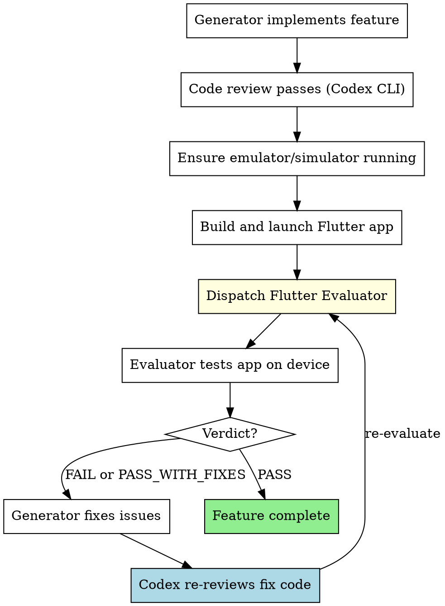

# Flutter App Evaluation

Every Flutter feature with user-visible UI must be verified by a Flutter Evaluator that interacts with the running app on an emulator/simulator like a real user. Code review alone is insufficient — the app must be tapped, swiped, and tested on a device.

**Core principle:** If a user can't tap it and see it work on their phone, it's not done.

**This is non-negotiable for Flutter projects.**

## When This Applies

**Detection signals** (need at least 2, or 1 strong signal):
- Project has `pubspec.yaml` with `flutter` SDK dependency
- Files with `.dart` extension in `lib/` directory being modified
- User mentions "Flutter", "mobile app", "Android", "iOS", "widget"
- Project has `android/` and/or `ios/` directories

**Explicit exclusions (DO NOT trigger):**
- Dart CLI tools or server-side Dart (no Flutter SDK)
- Flutter packages/plugins with no runnable app
- Pure unit test changes with no UI impact
- `pubspec.yaml` dependency updates only

## Prerequisites

Before Flutter evaluation can run, the environment needs:

### Android
```bash
# --- Reap emulators/flutter leaked by prior CRASHED evals (verifies cmdline, so PID reuse is safe) ---
for t in /tmp/flutter-eval-*.track; do
  [ -e "$t" ] || continue
  ep=$(awk -F= '/^emulator_pid=/{print $2}' "$t")
  [ -n "$ep" ] && grep -qa 'qemu\|emulator' /proc/$ep/cmdline 2>/dev/null && kill "$ep" 2>/dev/null
  fp=$(awk -F= '/^flutter_pid=/{print $2}' "$t")
  [ -n "$fp" ] && grep -qa 'flutter\|dart' /proc/$fp/cmdline 2>/dev/null && { pkill -P "$fp" 2>/dev/null; kill "$fp" 2>/dev/null; }
  rm -f "$t"
done

# --- Start the emulator ONLY if none is running; record what WE start so Teardown is exact ---
AVD=<avd_name>                                    # pick one from `emulator -list-avds`
TRACK="/tmp/flutter-eval-${AVD}.track"; : > "$TRACK"
if adb devices | grep -q "emulator-"; then
  # User already has one running — note it and DO NOT kill it at teardown
  echo "emulator_preexisting=$(adb devices | awk '/emulator-/{print $1; exit}')" >> "$TRACK"
else
  emulator -avd "$AVD" -no-window -no-snapshot -no-boot-anim -gpu swiftshader_indirect &
  echo "emulator_pid=$!" >> "$TRACK"
  adb wait-for-device
  adb shell getprop sys.boot_completed | grep -q "1"
  echo "emulator_started=$(adb devices | awk '/emulator-/{print $1; exit}')" >> "$TRACK"
fi
```

### iOS (macOS only)
```bash
# Verify simulator is booted
xcrun simctl list devices booted | grep -q "Booted"

# If not booted, find and boot one
xcrun simctl list devices available | grep "iPhone"
xcrun simctl boot "iPhone 15 Pro"

# Readiness: simulator should be booted
xcrun simctl list devices booted
```

### Flutter App
```bash
# Build and run on target device
flutter run -d <device_id> &

# Readiness probe: wait for "Flutter run key commands" in output
# or check for app process
adb shell ps | grep -q "com.example.app"  # Android
xcrun simctl get_app_status booted com.example.app  # iOS
```

## The Evaluation Loop



## How to Dispatch the Evaluator

### Step 1: Ensure device is running and app is built

```bash
# Android — device is already up + tracked via Prerequisites above (reuse the same $AVD/$TRACK).
AVD=<avd_name>; TRACK="/tmp/flutter-eval-${AVD}.track"
DEVICE=$(adb devices | awk '/emulator-/{print $1; exit}')
flutter run -d "$DEVICE" &
echo "flutter_pid=$!" >> "$TRACK"        # record so Teardown stops exactly this process
# Readiness probe (no blind sleep): wait until the app process is up
for i in $(seq 1 60); do adb shell ps 2>/dev/null | grep -q "com.example" && break; sleep 1; done

# iOS — only record ios_booted if WE boot it (so Teardown shuts down only our simulator)
TRACK="/tmp/flutter-eval-ios.track"; : > "$TRACK"
xcrun simctl list devices booted | grep -q "Booted" || { xcrun simctl boot "iPhone 15 Pro"; echo "ios_booted=iPhone 15 Pro" >> "$TRACK"; }
flutter run -d <simulator_id> &
echo "flutter_pid=$!" >> "$TRACK"
for i in $(seq 1 60); do xcrun simctl get_app_status booted com.example.app 2>/dev/null | grep -q Running && break; sleep 1; done
```

### Step 2: Dispatch Flutter Evaluator

See `./flutter-evaluator-prompt.md` for the full dispatch template.

Key fields:
- **Target platform(s):** Android / iOS / Both
- **App package name:** e.g., `com.example.myapp`
- **What Was Built (CLAIM ONLY):** from implementer, labeled as unverified
- **Requirements (SOURCE OF TRUTH):** full task spec
- **Specific Test Scenarios:** concrete steps with expected outcomes

### Step 3: Act on the Verdict

| Verdict | Action |
|---------|--------|
| **PASS** | Feature complete. Proceed. |
| **PASS_WITH_FIXES** | Fix Important issues → Codex re-reviews → hot reload → re-evaluate |
| **FAIL** | Fix Critical issues → Codex re-reviews → hot restart → re-evaluate |

### Step 4: Re-evaluation with Hot Reload

Flutter's hot reload makes the fix-evaluate loop fast:

```bash
# After fix, if app is still running:
# Hot reload (preserves state)
adb shell input keyevent 82  # or send 'r' to flutter run process

# Hot restart (resets state)
# Send 'R' to flutter run process
```

**Terminal conditions (escalate to user when ANY is hit):**
- 3 consecutive FAIL verdicts on the same issues
- 3 consecutive PASS_WITH_FIXES where the same Important issue persists
- Total of 5 evaluation rounds on a single task
- The task may need to be re-scoped or the approach changed

## Teardown (MANDATORY — run on EVERY exit path)

The evaluation **owns every process it started**. An Android emulator is 2–8 GB RAM + a full CPU core, and neither it nor the `flutter run` / dart process exits on its own. Leaving them alive is the #1 cause of this machine grinding to a halt: each eval round strands another emulator until the box thrashes (4 stranded emulators have done exactly this).

Run this the moment evaluation ends — **on PASS, on FAIL, and when escalating to the user**. It stops only what THIS run started (recorded in `$TRACK`), never an emulator the user already had open:

```bash
for TRACK in "/tmp/flutter-eval-${AVD}.track" /tmp/flutter-eval-ios.track; do
  [ -f "$TRACK" ] || continue
  fp=$(awk -F= '/^flutter_pid=/{print $2}' "$TRACK")
  if [ -n "$fp" ] && grep -qa 'flutter\|dart' /proc/$fp/cmdline 2>/dev/null; then
    pkill -P "$fp" 2>/dev/null; kill "$fp" 2>/dev/null          # stop `flutter run` + its dart child (scoped, not a broad pkill)
  fi
  es=$(awk -F= '/^emulator_started=/{print $2}' "$TRACK")
  if [ -n "$es" ]; then
    adb -s "$es" emu kill 2>/dev/null                            # graceful shutdown (releases the AVD lock)
    ep=$(awk -F= '/^emulator_pid=/{print $2}' "$TRACK")
    [ -n "$ep" ] && grep -qa 'qemu\|emulator' /proc/$ep/cmdline 2>/dev/null && kill "$ep" 2>/dev/null  # fallback if wedged
  fi
  ib=$(awk -F= '/^ios_booted=/{print $2}' "$TRACK")
  [ -n "$ib" ] && xcrun simctl shutdown "$ib" 2>/dev/null        # only if WE booted it
  rm -f "$TRACK"
done
# Confirm nothing of ours survived
adb devices; pgrep -af 'flutter_tools.*run' && echo "WARN: a flutter run is still alive — investigate" || echo "clean: no leaked flutter run"
```

A track file with `emulator_preexisting=` means that device was the user's — **never kill it**; only stop the `flutter run` you launched on it.

## Integration with Subagent-Driven Development

```
Per Task (UI-visible):
1. Implementer builds feature (Claude)
2. Spec reviewer (Codex CLI) ✅
3. Code quality reviewer (Codex CLI) ✅
4. Start emulator/simulator + build app
5. Flutter Evaluator tests on device ✅
6. Mark task complete

Per Task (logic/data only — no UI):
1-3 same as above
4. Skip Flutter eval → mark complete
```

**Per-task Flutter evaluation:** Only when the task produces user-visible changes.
**Final full-app evaluation:** ALWAYS mandatory after all tasks — tests complete user journeys across both platforms.

## What the Evaluator Checks

### Functionality (FIRST PRIORITY)
- Every button/tap target works
- Forms validate and submit correctly
- Navigation: push, pop, tabs, drawers
- Loading states during async operations
- Error states display properly
- Pull-to-refresh, infinite scroll

### Platform-Specific
- **Android:** Back button behavior, material design conventions, status bar
- **iOS:** Swipe-to-go-back, cupertino widgets where expected, safe area
- **Both:** Platform-appropriate dialogs, date pickers, navigation patterns

### Robustness
- Rotation: portrait → landscape → portrait
- Background → foreground: state preserved?
- Dark mode: all text visible? Proper contrast?
- Empty states: what happens with no data?
- Keyboard: does it dismiss properly? Does it push content up?

### Technical Health
- Flutter errors in logs (RenderFlex overflow, setState after dispose)
- Jank/frame drops
- Memory warnings
- API failures
- Crash-free operation

### Visual Quality
- Consistent spacing, typography, colors
- Platform-appropriate design language
- No overflow, clipping, or misalignment
- Proper responsive behavior at different screen sizes

## Red Flags

**Never:**
- Leave the emulator/simulator or `flutter run` process alive after evaluation — ALWAYS run **Teardown** (even on FAIL or escalation). Each stranded emulator is 2–8 GB RAM + a full CPU core and they pile up across rounds until the machine thrashes.
- Skip Flutter evaluation for tasks with user-visible UI
- Trust the Generator's claim that "it works"
- Test on only one platform when both are available
- Give PASS with any Critical issues
- Give PASS with any Important issues
- Guess tap coordinates — always dump UI tree
- Ignore Flutter error logs
- Skip Codex re-review on fix code

**If app won't build/launch:**
- Check `flutter doctor` output
- Check build errors in logs
- Report as Critical blocker

## Why This Matters

Mobile apps have failure modes that code review cannot catch:
1. Touch targets too small or overlapping
2. Keyboard obscuring input fields
3. Rotation breaking layout
4. Platform-specific navigation expectations
5. Performance issues only visible on device
6. Dark mode making text invisible
7. The Generator is biased toward its own work
