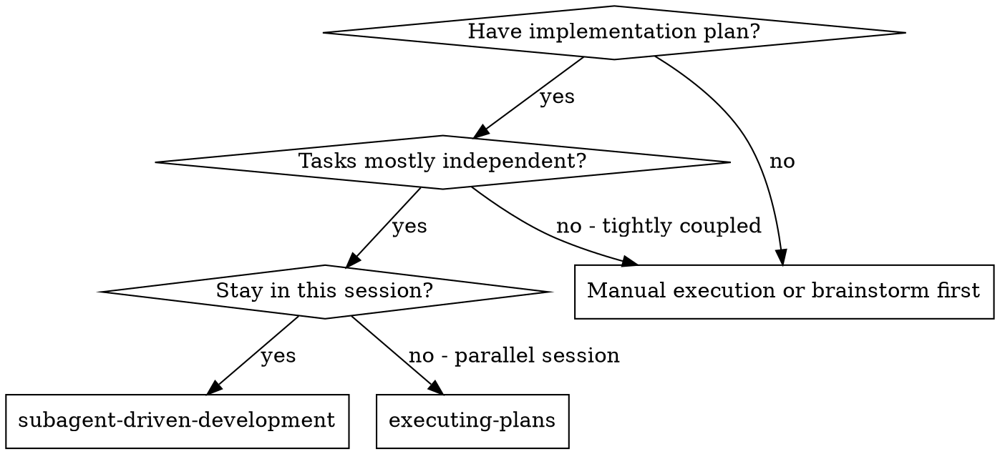
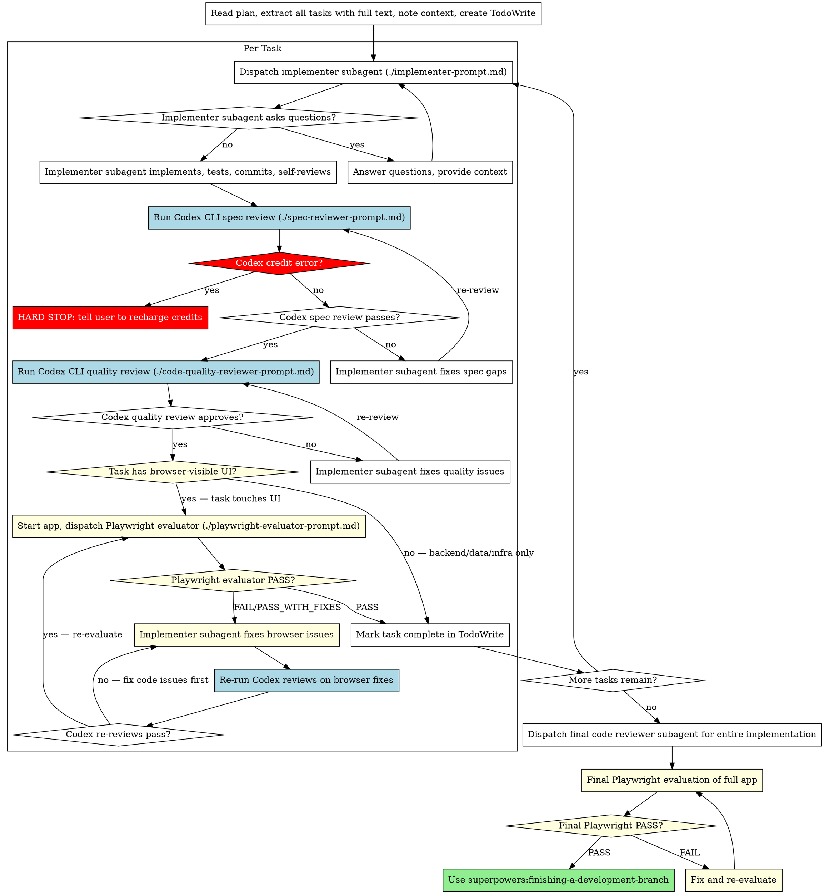

# Subagent-Driven Development

Execute plan by dispatching fresh subagent per task, with multi-stage review after each: spec compliance review first, then code quality review, then **Playwright browser evaluation for web projects**.

**Why subagents:** You delegate tasks to specialized agents with isolated context. By precisely crafting their instructions and context, you ensure they stay focused and succeed at their task. They should never inherit your session's context or history — you construct exactly what they need. This also preserves your own context for coordination work.

**Core principle:** Fresh subagent per task + multi-stage review (spec → quality → browser evaluation) = high quality, fast iteration

**Generator-Evaluator pattern:** Inspired by the Anthropic blog on autonomous development harnesses. The Generator (Claude implementer) builds, the Evaluator (Codex CLI/GPT for code review + Playwright for browser testing) verifies. Using a **different model family** for evaluation eliminates self-evaluation bias completely.

**Codex CLI credit requirement:** All code reviews (spec + quality) run through Codex CLI. If credits are exhausted, ALL WORK STOPS immediately. No fallback to Claude review. No skipping reviews. User must recharge OpenAI credits before proceeding.

## When to Use



**vs. Executing Plans (parallel session):**
- Same session (no context switch)
- Fresh subagent per task (no context pollution)
- Two-stage review after each task: spec compliance first, then code quality
- Faster iteration (no human-in-loop between tasks)

## The Process



## Model Selection

**Generator (Claude):** Use the least powerful Claude model that can handle each implementation task.
- Mechanical tasks (1-2 files, clear spec) → fast/cheap Claude model
- Integration tasks (multi-file) → standard Claude model
- Architecture tasks → most capable Claude model

**Evaluator (Codex CLI):** Always uses the configured Codex model (default: `gpt-5.5` with `xhigh` reasoning). This is configured in `~/.codex/config.toml`, not controlled per-task.

**Playwright Evaluator:** Uses Claude (inherits parent model) — it needs Playwright MCP tools which Codex doesn't have.

## Handling Implementer Status

Implementer subagents report one of four statuses. Handle each appropriately:

**DONE:** Proceed to spec compliance review.

**DONE_WITH_CONCERNS:** The implementer completed the work but flagged doubts. Read the concerns before proceeding. If the concerns are about correctness or scope, address them before review. If they're observations (e.g., "this file is getting large"), note them and proceed to review.

**NEEDS_CONTEXT:** The implementer needs information that wasn't provided. Provide the missing context and re-dispatch.

**BLOCKED:** The implementer cannot complete the task. Assess the blocker:
1. If it's a context problem, provide more context and re-dispatch with the same model
2. If the task requires more reasoning, re-dispatch with a more capable model
3. If the task is too large, break it into smaller pieces
4. If the plan itself is wrong, escalate to the human

**Never** ignore an escalation or force the same model to retry without changes. If the implementer said it's stuck, something needs to change.

## Prompt Templates

- `./implementer-prompt.md` - Dispatch Claude implementer subagent (Generator)
- `./spec-reviewer-prompt.md` - Run Codex CLI spec compliance review (Evaluator)
- `./code-quality-reviewer-prompt.md` - Run Codex CLI code quality review (Evaluator)
- `./playwright-evaluator-prompt.md` - Dispatch Playwright browser evaluator (Evaluator, web projects only)
- `./flutter-evaluator-prompt.md` - Dispatch Flutter device evaluator (Evaluator, Flutter projects only)

**Generator = Claude** (writes code) | **Evaluator = Codex/GPT** (reviews code) + **Playwright** (web UI) + **Flutter Evaluator** (mobile UI)

## Web Project Detection

A project is a "web project" if ANY of these are true:
- Has `.jsx`, `.tsx`, `.vue`, `.svelte`, or `.html` files being modified
- Uses React, Vue, Svelte, Next.js, Nuxt, SvelteKit, or similar frameworks
- Has a frontend dev server (Vite, Webpack, etc.)
- Task involves UI components, pages, layouts, or user-facing features
- Plan mentions "frontend", "UI", "dashboard", "web app", or similar

**When detected as web project:**
1. Ensure dev server is started before Playwright evaluation
2. Playwright evaluation applies **per-task only when the task has browser-visible UI changes** (components, pages, layouts, styles, user interactions)
3. Tasks that are backend-only, data layer, or infrastructure (e.g., "Todo Store", "API routes", "database schema") skip Playwright — unit/integration tests are sufficient
4. Final Playwright evaluation covers the **entire app** after all tasks complete — this one is always mandatory
5. The evaluator tests at mobile, tablet, and desktop viewports

**Per-task Playwright trigger:** Does this specific task produce something a user can see or interact with in the browser? If yes → Playwright. If no → skip to mark complete.

## Flutter Project Detection

A project is a "Flutter project" if:
- Has `pubspec.yaml` with `flutter` SDK dependency
- Has `.dart` files in `lib/` directory being modified
- Has `android/` and/or `ios/` directories
- Plan mentions "Flutter", "mobile app", "widget"

**When detected as Flutter project:**
1. Ensure emulator (Android) and/or simulator (iOS) is running
2. Flutter evaluation applies **per-task only when the task has user-visible UI changes**
3. Tasks that are data layer, repository, or business logic only skip Flutter eval
4. Final Flutter evaluation covers the **entire app** on all available platforms
5. The evaluator tests rotation, dark mode, and platform-specific behavior

**Per-task Flutter trigger:** Does this specific task produce something a user can see or interact with on the device? If yes → Flutter Evaluator. If no → skip.

**Web vs Flutter:** If the project is Flutter Web, use Playwright. If native Android/iOS, use Flutter Evaluator. If both, use both.

## Example Workflow (Non-Web Project)

```
You: I'm using Subagent-Driven Development to execute this plan.

[Read plan file once: docs/superpowers/plans/feature-plan.md]
[Extract all 5 tasks with full text and context]
[Detect: No web UI files → skip Playwright evaluation]
[Create TodoWrite with all tasks]

Task 1: Hook installation script

[Dispatch Claude implementer subagent]
Implementer: DONE — implemented install-hook command, 5/5 tests passing

[Run Codex CLI spec review]
$ codex review --base a7981ec "Review spec compliance for Task 1..."
Codex (GPT): ✅ Spec compliant — all requirements met

[Run Codex CLI quality review]
$ codex review --base a7981ec "Review code quality for Task 1..."
Codex (GPT): Strengths: Good test coverage. Issues: None. Ready: Yes.

[Mark Task 1 complete]

Task 2: Recovery modes

[Dispatch Claude implementer → Codex spec review (fail) → fix → Codex spec (pass) → Codex quality (pass)]

[After all tasks → Codex final review → finishing-a-development-branch]
```

## Example Workflow (Web Project — with Codex + Playwright)

```
You: I'm using Subagent-Driven Development to execute this plan.

[Read plan file once: docs/superpowers/plans/dashboard-plan.md]
[Detect: React + Vite → Codex reviews MANDATORY + Playwright evaluation MANDATORY]
[Create TodoWrite with all tasks]

Task 1: User dashboard page

[Dispatch Claude implementer subagent]
Implementer:
  - Built Dashboard component with user stats cards
  - Added API route /api/stats
  - 6/6 tests passing, committed

[Run Codex CLI spec review]
$ codex review --base abc123 "Review spec compliance..."
Codex (GPT): ✅ Spec compliant

[Run Codex CLI quality review]
$ codex review --base abc123 "Review code quality..."
Codex (GPT): Strengths: Clean components. Issues: None. Ready: Yes.

[Web project → Start dev server: npm run dev]
[Dispatch Playwright evaluator at http://localhost:5173]

Playwright Evaluator:
  Overall Score: 32/50
  Important Issues:
    - Stats cards have no loading state (shows "undefined" briefly)
    - No error state when API fails
  Verdict: PASS_WITH_FIXES

[Claude implementer fixes: adds loading skeleton + error state]
[Re-dispatch Playwright evaluator]

Playwright Evaluator:
  Overall Score: 38/50
  Verdict: PASS

[Mark Task 1 complete]

...

## Example: Credit Exhausted — HARD STOP

Task 3: Settings page

[Dispatch Claude implementer → DONE]

[Run Codex CLI spec review]
$ codex review --base def456 "Review spec compliance..."
ERROR: Rate limit exceeded. Please check your billing at...

⛔ HARD STOP

You: "Codex CLI 크레딧이 소진되었습니다.
리뷰를 건너뛸 수 없으므로 작업을 즉시 중단합니다.
OpenAI 계정에서 크레딧을 충전해주세요: https://platform.openai.com/account/billing
충전 완료 후 알려주시면 Task 3 리뷰부터 이어서 진행하겠습니다."

[WAIT for user confirmation — do NOT proceed]
```

## Advantages

**vs. Manual execution:**
- Subagents follow TDD naturally
- Fresh context per task (no confusion)
- Parallel-safe (subagents don't interfere)
- Subagent can ask questions (before AND during work)

**vs. Executing Plans:**
- Same session (no handoff)
- Continuous progress (no waiting)
- Review checkpoints automatic

**Efficiency gains:**
- No file reading overhead (controller provides full text)
- Controller curates exactly what context is needed
- Subagent gets complete information upfront
- Questions surfaced before work begins (not after)

**Quality gates:**
- Self-review catches issues before handoff
- Multi-stage review: spec compliance → code quality → Playwright browser evaluation
- Review loops ensure fixes actually work
- Spec compliance prevents over/under-building
- Code quality ensures implementation is well-built
- Playwright evaluation catches what code review cannot: visual bugs, broken interactions, missing states

**Cost:**
- More subagent invocations (implementer + 2-3 reviewers per task)
- Controller does more prep work (extracting all tasks upfront)
- Review loops add iterations
- Playwright evaluation adds browser interaction time
- But catches issues early (cheaper than debugging later)
- From Anthropic's data: ~20x cost increase yields fundamental quality difference

## Red Flags

**Never:**
- Start implementation on main/master branch without explicit user consent
- Skip reviews (spec compliance OR code quality OR Playwright for web projects)
- Skip Playwright evaluation for web projects ("code review is enough" — NO, it is NOT)
- Proceed with unfixed issues
- Dispatch multiple implementation subagents in parallel (conflicts)
- Make subagent read plan file (provide full text instead)
- Skip scene-setting context (subagent needs to understand where task fits)
- Ignore subagent questions (answer before letting them proceed)
- Accept "close enough" on spec compliance (spec reviewer found issues = not done)
- Skip review loops (reviewer found issues = implementer fixes = review again)
- Let implementer self-review replace actual review (both are needed)
- **Start code quality review before spec compliance is ✅** (wrong order)
- Move to next task while either review has open issues

**If subagent asks questions:**
- Answer clearly and completely
- Provide additional context if needed
- Don't rush them into implementation

**If reviewer finds issues:**
- Implementer (same subagent) fixes them
- Reviewer reviews again
- Repeat until approved
- Don't skip the re-review

**If subagent fails task:**
- Dispatch fix subagent with specific instructions
- Don't try to fix manually (context pollution)

## Integration

**Required workflow skills:**
- **superpowers:using-git-worktrees** - REQUIRED: Set up isolated workspace before starting
- **superpowers:writing-plans** - Creates the plan this skill executes
- **codex-cli** - REQUIRED: Codex CLI for spec + quality reviews (must have credits)
- **superpowers:web-app-evaluation** - REQUIRED for web projects: Playwright browser evaluation
- **superpowers:finishing-a-development-branch** - Complete development after all tasks

**Subagents should use:**
- **superpowers:test-driven-development** - Subagents follow TDD for each task

**Evaluator tools:**
- **Codex CLI** (`codex review`) - Code review via GPT (different model = no self-evaluation bias)
- **superpowers:playwright-evaluator** - Browser-based UI evaluation agent (web projects only)
- **superpowers:flutter-evaluator** - Emulator/simulator-based evaluation agent (Flutter projects only)

**Prerequisites:**
- OpenAI API credits must be available for Codex CLI
- If credits run out mid-workflow: HARD STOP, no exceptions

**Alternative workflow:**
- **superpowers:executing-plans** - Use for parallel session instead of same-session execution
