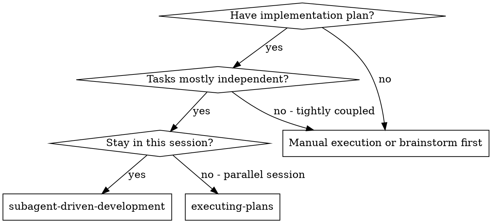
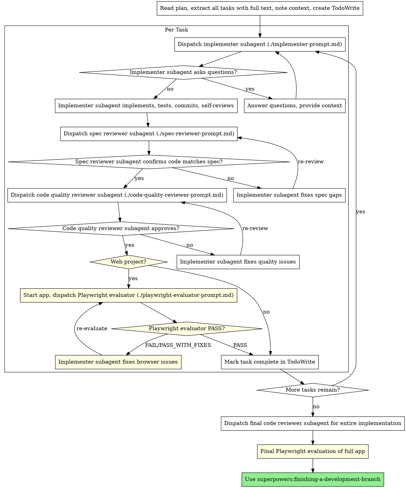

# Subagent-Driven Development

Execute plan by dispatching fresh subagent per task, with multi-stage review after each: spec compliance review first, then code quality review, then **Playwright browser evaluation for web projects**.

**Why subagents:** You delegate tasks to specialized agents with isolated context. By precisely crafting their instructions and context, you ensure they stay focused and succeed at their task. They should never inherit your session's context or history — you construct exactly what they need. This also preserves your own context for coordination work.

**Core principle:** Fresh subagent per task + multi-stage review (spec → quality → browser evaluation) = high quality, fast iteration

**Generator-Evaluator pattern:** Inspired by the Anthropic blog on autonomous development harnesses. The Generator (implementer) builds, the Evaluator (reviewer + Playwright) verifies. Separate agents prevent self-evaluation bias.

## When to Use



**vs. Executing Plans (parallel session):**
- Same session (no context switch)
- Fresh subagent per task (no context pollution)
- Two-stage review after each task: spec compliance first, then code quality
- Faster iteration (no human-in-loop between tasks)

## The Process



## Model Selection

Use the least powerful model that can handle each role to conserve cost and increase speed.

**Mechanical implementation tasks** (isolated functions, clear specs, 1-2 files): use a fast, cheap model. Most implementation tasks are mechanical when the plan is well-specified.

**Integration and judgment tasks** (multi-file coordination, pattern matching, debugging): use a standard model.

**Architecture, design, and review tasks**: use the most capable available model.

**Task complexity signals:**
- Touches 1-2 files with a complete spec → cheap model
- Touches multiple files with integration concerns → standard model
- Requires design judgment or broad codebase understanding → most capable model

## Handling Implementer Status

Implementer subagents report one of four statuses. Handle each appropriately:

**DONE:** Proceed to spec compliance review.

**DONE_WITH_CONCERNS:** The implementer completed the work but flagged doubts. Read the concerns before proceeding. If the concerns are about correctness or scope, address them before review. If they're observations (e.g., "this file is getting large"), note them and proceed to review.

**NEEDS_CONTEXT:** The implementer needs information that wasn't provided. Provide the missing context and re-dispatch.

**BLOCKED:** The implementer cannot complete the task. Assess the blocker:
1. If it's a context problem, provide more context and re-dispatch with the same model
2. If the task requires more reasoning, re-dispatch with a more capable model
3. If the task is too large, break it into smaller pieces
4. If the plan itself is wrong, escalate to the human

**Never** ignore an escalation or force the same model to retry without changes. If the implementer said it's stuck, something needs to change.

## Prompt Templates

- `./implementer-prompt.md` - Dispatch implementer subagent
- `./spec-reviewer-prompt.md` - Dispatch spec compliance reviewer subagent
- `./code-quality-reviewer-prompt.md` - Dispatch code quality reviewer subagent
- `./playwright-evaluator-prompt.md` - Dispatch Playwright browser evaluator (web projects only)

## Web Project Detection

A project is a "web project" if ANY of these are true:
- Has `.jsx`, `.tsx`, `.vue`, `.svelte`, or `.html` files being modified
- Uses React, Vue, Svelte, Next.js, Nuxt, SvelteKit, or similar frameworks
- Has a frontend dev server (Vite, Webpack, etc.)
- Task involves UI components, pages, layouts, or user-facing features
- Plan mentions "frontend", "UI", "dashboard", "web app", or similar

**When detected as web project:**
1. Ensure dev server is started before Playwright evaluation
2. Playwright evaluation is MANDATORY after code quality review passes
3. Final Playwright evaluation covers the entire app after all tasks complete
4. The evaluator tests at mobile, tablet, and desktop viewports

## Example Workflow (Non-Web Project)

```
You: I'm using Subagent-Driven Development to execute this plan.

[Read plan file once: docs/superpowers/plans/feature-plan.md]
[Extract all 5 tasks with full text and context]
[Detect: No web UI files → skip Playwright evaluation]
[Create TodoWrite with all tasks]

Task 1: Hook installation script
[Dispatch implementer → spec review → code quality review → complete]

Task 2: Recovery modes
[Dispatch implementer → spec review (fail, fix, pass) → code quality (fail, fix, pass) → complete]

[After all tasks → final code review → finishing-a-development-branch]
```

## Example Workflow (Web Project — with Playwright Evaluation)

```
You: I'm using Subagent-Driven Development to execute this plan.

[Read plan file once: docs/superpowers/plans/dashboard-plan.md]
[Extract all 4 tasks with full text and context]
[Detect: React + Vite project → Playwright evaluation MANDATORY]
[Create TodoWrite with all tasks]

Task 1: User dashboard page

[Dispatch implementer subagent]
Implementer:
  - Built Dashboard component with user stats cards
  - Added API route /api/stats
  - 6/6 tests passing
  - Committed

[Spec reviewer] ✅ Spec compliant

[Code quality reviewer] ✅ Approved

[Web project detected → Start dev server: npm run dev]
[Dispatch Playwright evaluator at http://localhost:5173]

Playwright Evaluator:
  Overall Score: 32/50
  - Design Quality: 6/10 — Cards lack visual hierarchy
  - Originality: 5/10 — Generic Bootstrap look
  - Technical Polish: 7/10 — Good spacing, minor alignment issues
  - Functionality: 7/10 — Stats load correctly
  - User Experience: 7/10 — Clear layout but boring

  Critical Issues: None
  Important Issues:
    - Stats cards have no loading state (shows "undefined" briefly)
    - No error state when API fails
  Minor Issues:
    - Cards could use subtle shadows for depth

  Verdict: PASS_WITH_FIXES

[Implementer fixes: adds loading skeleton + error state]
[Re-dispatch Playwright evaluator]

Playwright Evaluator:
  Overall Score: 38/50
  - Functionality: 9/10 — Loading and error states work perfectly
  Verdict: PASS

[Mark Task 1 complete]

Task 2: Data visualization charts
[Dispatch implementer → spec review → code quality → Playwright evaluation → ...]

...

[After all tasks]
[Dispatch final code reviewer]
[Dispatch final Playwright evaluator for full app flow]
Final Playwright evaluation:
  - Tested complete user journey: login → dashboard → charts → settings
  - All pages responsive at 375px, 768px, 1280px
  - No console errors across all pages
  - Overall: 41/50, Verdict: PASS

[Use superpowers:finishing-a-development-branch]
```

## Advantages

**vs. Manual execution:**
- Subagents follow TDD naturally
- Fresh context per task (no confusion)
- Parallel-safe (subagents don't interfere)
- Subagent can ask questions (before AND during work)

**vs. Executing Plans:**
- Same session (no handoff)
- Continuous progress (no waiting)
- Review checkpoints automatic

**Efficiency gains:**
- No file reading overhead (controller provides full text)
- Controller curates exactly what context is needed
- Subagent gets complete information upfront
- Questions surfaced before work begins (not after)

**Quality gates:**
- Self-review catches issues before handoff
- Multi-stage review: spec compliance → code quality → Playwright browser evaluation
- Review loops ensure fixes actually work
- Spec compliance prevents over/under-building
- Code quality ensures implementation is well-built
- Playwright evaluation catches what code review cannot: visual bugs, broken interactions, missing states

**Cost:**
- More subagent invocations (implementer + 2-3 reviewers per task)
- Controller does more prep work (extracting all tasks upfront)
- Review loops add iterations
- Playwright evaluation adds browser interaction time
- But catches issues early (cheaper than debugging later)
- From Anthropic's data: ~20x cost increase yields fundamental quality difference

## Red Flags

**Never:**
- Start implementation on main/master branch without explicit user consent
- Skip reviews (spec compliance OR code quality OR Playwright for web projects)
- Skip Playwright evaluation for web projects ("code review is enough" — NO, it is NOT)
- Proceed with unfixed issues
- Dispatch multiple implementation subagents in parallel (conflicts)
- Make subagent read plan file (provide full text instead)
- Skip scene-setting context (subagent needs to understand where task fits)
- Ignore subagent questions (answer before letting them proceed)
- Accept "close enough" on spec compliance (spec reviewer found issues = not done)
- Skip review loops (reviewer found issues = implementer fixes = review again)
- Let implementer self-review replace actual review (both are needed)
- **Start code quality review before spec compliance is ✅** (wrong order)
- Move to next task while either review has open issues

**If subagent asks questions:**
- Answer clearly and completely
- Provide additional context if needed
- Don't rush them into implementation

**If reviewer finds issues:**
- Implementer (same subagent) fixes them
- Reviewer reviews again
- Repeat until approved
- Don't skip the re-review

**If subagent fails task:**
- Dispatch fix subagent with specific instructions
- Don't try to fix manually (context pollution)

## Integration

**Required workflow skills:**
- **superpowers:using-git-worktrees** - REQUIRED: Set up isolated workspace before starting
- **superpowers:writing-plans** - Creates the plan this skill executes
- **superpowers:requesting-code-review** - Code review template for reviewer subagents
- **superpowers:web-app-evaluation** - REQUIRED for web projects: Playwright browser evaluation
- **superpowers:finishing-a-development-branch** - Complete development after all tasks

**Subagents should use:**
- **superpowers:test-driven-development** - Subagents follow TDD for each task

**Evaluator agents:**
- **superpowers:playwright-evaluator** - Browser-based evaluation agent for web projects

**Alternative workflow:**
- **superpowers:executing-plans** - Use for parallel session instead of same-session execution
