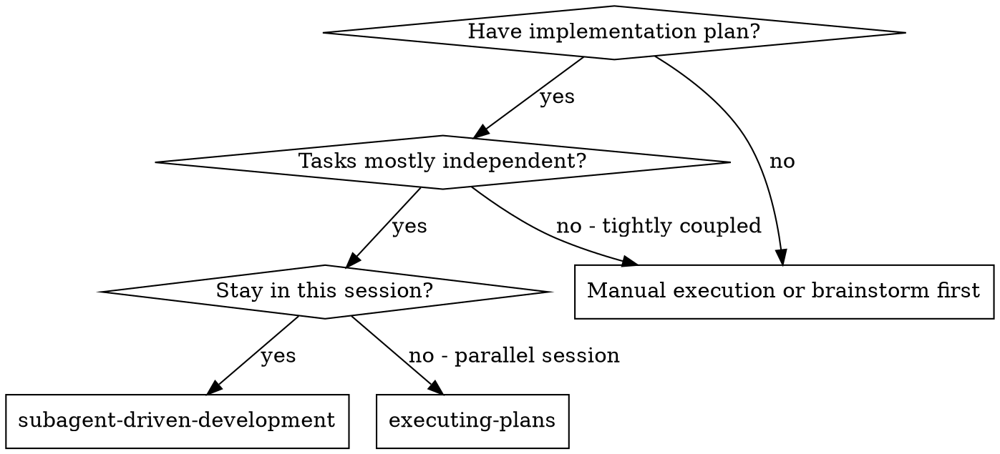
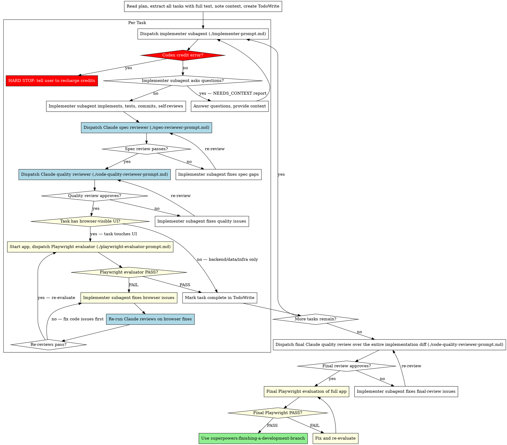

# Subagent-Driven Development

Execute plan by dispatching fresh subagent per task, with multi-stage review after each: spec compliance review first, then code quality review, then **Playwright browser evaluation for web projects**.

**Why subagents:** You delegate tasks to specialized agents with isolated context. By precisely crafting their instructions and context, you ensure they stay focused and succeed at their task. They should never inherit your session's context or history — you construct exactly what they need. This also preserves your own context for coordination work.

**Core principle:** Fresh subagent per task + multi-stage review (spec → quality → browser evaluation) = high quality, fast iteration

**Generator-Evaluator pattern:** Inspired by the Anthropic blog on autonomous development harnesses. The Generator (**Codex/GPT implementer**, dispatched via the `codex-worker` agent) builds, the Evaluator (**fresh-context Claude subagents** for spec + quality review, plus Playwright for browser testing) verifies. Using a **different model family** for evaluation eliminates self-evaluation bias completely — same property as the pre-2026-07-13 layout (Claude built, GPT reviewed), roles flipped.

**Codex CLI credit requirement:** All implementation runs through Codex CLI (via codex-worker, OpenAI billing). If credits are exhausted, ALL WORK STOPS immediately. No fallback to a Claude implementer. User must recharge OpenAI credits before proceeding. (Reviews are Claude subagents on the session's own subscription — they have no OpenAI-credit failure mode.)

## Codex invocation is encapsulated — do not call codex directly

This skill no longer contains raw `codex` commands. Every codex run goes through the **`codex-worker` agent** (`~/.claude/agents/codex-worker.md`), which owns the host-safe invocation: pinned `gpt-5.6-sol` + `max` reasoning, `-s danger-full-access` (bwrap broken here), `-c mcp_servers='{}'` (playwright wedge), `timeout -k 60 1200` (guaranteed termination), and the bounded wait loop (subagents are NOT re-invoked by background-task completion — measured 2026-07-13). If you ever need codex outside a subagent, read the `codex-cli` skill first; **never `codex review`** on this host.

## Dispatching subagents: never idle-wait

Dispatch implementer/evaluator subagents **synchronously** (wait for the Agent tool result in
the same turn). If one runs in background anyway, do NOT end your turn "to wait for it" —
measured on this host (benchmark 2026-07-02, 3 of 6 controllers stalled): a turn that ends in
"waiting for the child" just sits there until a human nudges it, and a background child often
CANNOT message you back ("No agent named ... is currently addressable"). Before ever waiting,
check the child's artifacts on disk (file mtimes, its report file) — in every observed stall
the child had already finished and written its output.

## When to Use


```dot
digraph when_to_use {
    "Have implementation plan?" [shape=diamond];
    "Tasks mostly independent?" [shape=diamond];
    "Stay in this session?" [shape=diamond];
    "subagent-driven-development" [shape=box];
    "executing-plans" [shape=box];
    "Manual execution or brainstorm first" [shape=box];

    "Have implementation plan?" -> "Tasks mostly independent?" [label="yes"];
    "Have implementation plan?" -> "Manual execution or brainstorm first" [label="no"];
    "Tasks mostly independent?" -> "Stay in this session?" [label="yes"];
    "Tasks mostly independent?" -> "Manual execution or brainstorm first" [label="no - tightly coupled"];
    "Stay in this session?" -> "subagent-driven-development" [label="yes"];
    "Stay in this session?" -> "executing-plans" [label="no - parallel session"];
}
```

**vs. Executing Plans (parallel session):**
- Same session (no context switch)
- Fresh subagent per task (no context pollution)
- Two-stage review after each task: spec compliance first, then code quality
- Faster iteration (no human-in-loop between tasks)

## Trivial tasks: batch the review, never skip it

A task that is purely mechanical — single file, no new behavior or logic (typo/comment/doc
change, a rename fully verified by the type-checker, a config value the plan fixes verbatim) —
may skip its DEDICATED per-task review rounds and fold into the next task's review or the final
whole-diff review instead. Coverage is preserved: the final Claude quality review sees every line.
Any new behavior, branching, or user-visible change → full per-task gates. When unsure, run
the gates. (This keeps SDD usable as a library for mixed-size plans instead of taxing one-line
tasks with a full review cycle.)

## The Process


```dot
digraph process {
    rankdir=TB;

    subgraph cluster_per_task {
        label="Per Task";
        "Dispatch implementer subagent (./implementer-prompt.md)" [shape=box];
        "Implementer subagent asks questions?" [shape=diamond];
        "Answer questions, provide context" [shape=box];
        "Implementer subagent implements, tests, commits, self-reviews" [shape=box];
        "Dispatch Claude spec reviewer (./spec-reviewer-prompt.md)" [shape=box style=filled fillcolor=lightblue];
        "Spec review passes?" [shape=diamond];
        "Codex credit error?" [shape=diamond style=filled fillcolor=red fontcolor=white];
        "HARD STOP: tell user to recharge credits" [shape=box style=filled fillcolor=red fontcolor=white];
        "Implementer subagent fixes spec gaps" [shape=box];
        "Dispatch Claude quality reviewer (./code-quality-reviewer-prompt.md)" [shape=box style=filled fillcolor=lightblue];
        "Quality review approves?" [shape=diamond];
        "Implementer subagent fixes quality issues" [shape=box];
        "Task has browser-visible UI?" [shape=diamond style=filled fillcolor=lightyellow];
        "Start app, dispatch Playwright evaluator (./playwright-evaluator-prompt.md)" [shape=box style=filled fillcolor=lightyellow];
        "Playwright evaluator PASS?" [shape=diamond style=filled fillcolor=lightyellow];
        "Implementer subagent fixes browser issues" [shape=box style=filled fillcolor=lightyellow];
        "Re-run Claude reviews on browser fixes" [shape=box style=filled fillcolor=lightblue];
        "Re-reviews pass?" [shape=diamond];
        "Mark task complete in TodoWrite" [shape=box];
    }

    "Read plan, extract all tasks with full text, note context, create TodoWrite" [shape=box];
    "More tasks remain?" [shape=diamond];
    "Dispatch final Claude quality review over the entire implementation diff (./code-quality-reviewer-prompt.md)" [shape=box];
    "Final review approves?" [shape=diamond];
    "Implementer subagent fixes final-review issues" [shape=box];
    "Final Playwright evaluation of full app" [shape=box style=filled fillcolor=lightyellow];
    "Final Playwright PASS?" [shape=diamond style=filled fillcolor=lightyellow];
    "Fix and re-evaluate" [shape=box style=filled fillcolor=lightyellow];
    "Use superpowers:finishing-a-development-branch" [shape=box style=filled fillcolor=lightgreen];

    "Read plan, extract all tasks with full text, note context, create TodoWrite" -> "Dispatch implementer subagent (./implementer-prompt.md)";
    "Dispatch implementer subagent (./implementer-prompt.md)" -> "Codex credit error?";
    "Codex credit error?" -> "HARD STOP: tell user to recharge credits" [label="yes"];
    "Codex credit error?" -> "Implementer subagent asks questions?" [label="no"];
    "Implementer subagent asks questions?" -> "Answer questions, provide context" [label="yes — NEEDS_CONTEXT report"];
    "Answer questions, provide context" -> "Dispatch implementer subagent (./implementer-prompt.md)";
    "Implementer subagent asks questions?" -> "Implementer subagent implements, tests, commits, self-reviews" [label="no"];
    "Implementer subagent implements, tests, commits, self-reviews" -> "Dispatch Claude spec reviewer (./spec-reviewer-prompt.md)";
    "Dispatch Claude spec reviewer (./spec-reviewer-prompt.md)" -> "Spec review passes?";
    "Spec review passes?" -> "Implementer subagent fixes spec gaps" [label="no"];
    "Implementer subagent fixes spec gaps" -> "Dispatch Claude spec reviewer (./spec-reviewer-prompt.md)" [label="re-review"];
    "Spec review passes?" -> "Dispatch Claude quality reviewer (./code-quality-reviewer-prompt.md)" [label="yes"];
    "Dispatch Claude quality reviewer (./code-quality-reviewer-prompt.md)" -> "Quality review approves?";
    "Quality review approves?" -> "Implementer subagent fixes quality issues" [label="no"];
    "Implementer subagent fixes quality issues" -> "Dispatch Claude quality reviewer (./code-quality-reviewer-prompt.md)" [label="re-review"];
    "Quality review approves?" -> "Task has browser-visible UI?" [label="yes"];
    "Task has browser-visible UI?" -> "Start app, dispatch Playwright evaluator (./playwright-evaluator-prompt.md)" [label="yes — task touches UI"];
    "Task has browser-visible UI?" -> "Mark task complete in TodoWrite" [label="no — backend/data/infra only"];
    "Start app, dispatch Playwright evaluator (./playwright-evaluator-prompt.md)" -> "Playwright evaluator PASS?";
    "Playwright evaluator PASS?" -> "Mark task complete in TodoWrite" [label="PASS"];
    "Playwright evaluator PASS?" -> "Implementer subagent fixes browser issues" [label="FAIL"];
    "Implementer subagent fixes browser issues" -> "Re-run Claude reviews on browser fixes";
    "Re-run Claude reviews on browser fixes" -> "Re-reviews pass?";
    "Re-reviews pass?" -> "Start app, dispatch Playwright evaluator (./playwright-evaluator-prompt.md)" [label="yes — re-evaluate"];
    "Re-reviews pass?" -> "Implementer subagent fixes browser issues" [label="no — fix code issues first"];
    "Mark task complete in TodoWrite" -> "More tasks remain?";
    "More tasks remain?" -> "Dispatch implementer subagent (./implementer-prompt.md)" [label="yes"];
    "More tasks remain?" -> "Dispatch final Claude quality review over the entire implementation diff (./code-quality-reviewer-prompt.md)" [label="no"];
    "Dispatch final Claude quality review over the entire implementation diff (./code-quality-reviewer-prompt.md)" -> "Final review approves?";
    "Final review approves?" -> "Final Playwright evaluation of full app" [label="yes"];
    "Final review approves?" -> "Implementer subagent fixes final-review issues" [label="no"];
    "Implementer subagent fixes final-review issues" -> "Dispatch final Claude quality review over the entire implementation diff (./code-quality-reviewer-prompt.md)" [label="re-review"];
    "Final Playwright evaluation of full app" -> "Final Playwright PASS?";
    "Final Playwright PASS?" -> "Use superpowers:finishing-a-development-branch" [label="PASS"];
    "Final Playwright PASS?" -> "Fix and re-evaluate" [label="FAIL"];
    "Fix and re-evaluate" -> "Final Playwright evaluation of full app";
}
```

## Model Selection

**Generator (Codex/GPT):** the codex-worker agent pins `gpt-5.6-sol` at `max` reasoning on every dispatch — there is no per-task model tuning. The sizing lever is the TASK, not the model: a task that over-runs codex-worker's 20-min ceiling comes back as exit 124 → split it into smaller tasks and re-dispatch.

**Evaluator (Claude reviewers):** fresh-context `general-purpose` subagents inheriting the session model. Do not review in the controller's own context — the controller watched the implementation happen and is biased.

**Playwright Evaluator:** Uses Claude (inherits parent model) — it needs Playwright MCP tools, which codex can't use here (codex runs MCP-less on this host by design).

## Handling Implementer Status

Implementer subagents report one of four statuses. Handle each appropriately:

**DONE:** Proceed to spec compliance review.

**DONE_WITH_CONCERNS:** The implementer completed the work but flagged doubts. Read the concerns before proceeding. If the concerns are about correctness or scope, address them before review. If they're observations (e.g., "this file is getting large"), note them and proceed to review.

**NEEDS_CONTEXT:** The implementer needs information that wasn't provided. Provide the missing context and re-dispatch.

**BLOCKED:** The implementer cannot complete the task. Assess the blocker:
1. FIRST verify the dispatch carried the FULL task spec, acceptance criteria, and every file/context reference it needs — measured on this host, incomplete subagent output almost always traces to an incomplete spec reaching the subagent, not to model capability (effort/model A/B showed no completeness difference on well-specified tasks). Fix the spec and re-dispatch. Remember codex has NO memory of previous runs — a re-dispatch must carry the original spec plus the new context.
2. If the task is too large (or codex-worker returned exit 124), break it into smaller pieces
3. For genuinely ambiguous architectural work: make the decision yourself (controller) or escalate to the human — the implementer is already at max reasoning; there is no bigger model to throw at it
4. If the plan itself is wrong, escalate to the human

**Never** ignore an escalation or force the same model to retry without changes. If the implementer said it's stuck, something needs to change.

## Prompt Templates

- `./implementer-prompt.md` - Dispatch codex-worker implementer subagent (Generator, GPT)
- `./spec-reviewer-prompt.md` - Dispatch Claude spec compliance reviewer (Evaluator)
- `./code-quality-reviewer-prompt.md` - Dispatch Claude code quality reviewer (Evaluator)
- `./playwright-evaluator-prompt.md` - Dispatch Playwright browser evaluator (Evaluator, web projects only)
- `./flutter-evaluator-prompt.md` - Dispatch Flutter device evaluator (Evaluator, Flutter projects only)

**Generator = Codex/GPT** (writes code, via codex-worker) | **Evaluator = Claude** (reviews code) + **Playwright** (web UI) + **Flutter Evaluator** (mobile UI)

## Web Project Detection

A project is a "web project" if ANY of these are true:
- Has `.jsx`, `.tsx`, `.vue`, `.svelte`, or `.html` files being modified
- Uses React, Vue, Svelte, Next.js, Nuxt, SvelteKit, or similar frameworks
- Has a frontend dev server (Vite, Webpack, etc.)
- Task involves UI components, pages, layouts, or user-facing features
- Plan mentions "frontend", "UI", "dashboard", "web app", or similar

**When detected as web project:**
1. Ensure dev server is started before Playwright evaluation
2. Playwright evaluation applies **per-task only when the task has browser-visible UI changes** (components, pages, layouts, styles, user interactions)
3. Tasks that are backend-only, data layer, or infrastructure (e.g., "Todo Store", "API routes", "database schema") skip Playwright — unit/integration tests are sufficient
4. Final Playwright evaluation covers the **entire app** after all tasks complete — this one is always mandatory, and it must run as a BLIND checker per web-app-evaluation §"Final signoff must be a BLIND checker": operationalized checklist + fresh evaluator with no task history or project access (measured 2026-07-02: internal gates passed defects an independent checker caught instantly)
5. The evaluator tests at mobile, tablet, and desktop viewports

**Per-task Playwright trigger:** Does this specific task produce something a user can see or interact with in the browser? If yes → Playwright. If no → skip to mark complete.

## Flutter Project Detection

A project is a "Flutter project" if:
- Has `pubspec.yaml` with `flutter` SDK dependency
- Has `.dart` files in `lib/` directory being modified
- Has `android/` and/or `ios/` directories
- Plan mentions "Flutter", "mobile app", "widget"

**When detected as Flutter project:**
1. Ensure emulator (Android) and/or simulator (iOS) is running
2. Flutter evaluation applies **per-task only when the task has user-visible UI changes**
3. Tasks that are data layer, repository, or business logic only skip Flutter eval
4. Final Flutter evaluation covers the **entire app** on all available platforms
5. The evaluator tests rotation, dark mode, and platform-specific behavior

**Per-task Flutter trigger:** Does this specific task produce something a user can see or interact with on the device? If yes → Flutter Evaluator. If no → skip.

**Web vs Flutter:** If the project is Flutter Web, use Playwright. If native Android/iOS, use Flutter Evaluator. If both, use both.

## Example Workflow (Non-Web Project)

```
You: I'm using Subagent-Driven Development to execute this plan.

[Read plan file once: docs/superpowers/plans/feature-plan.md]
[Extract all 5 tasks with full text and context]
[Detect: No web UI files → skip Playwright evaluation]
[Create TodoWrite with all tasks]

Task 1: Hook installation script

[Dispatch codex-worker implementer subagent]
Implementer (GPT): DONE — implemented install-hook command, 5/5 tests passing

[Dispatch Claude spec reviewer subagent]
Claude reviewer: status: APPROVED — all requirements met

[Dispatch Claude quality reviewer subagent]
Claude reviewer: status: APPROVED — strengths: good test coverage; issues: none

[Mark Task 1 complete]

Task 2: Recovery modes

[Dispatch codex-worker implementer → Claude spec review (NEEDS_FIXES) → codex-worker fix → Claude spec (APPROVED) → Claude quality (APPROVED)]

[After all tasks → final Claude quality review over whole diff → finishing-a-development-branch]
```

## Example Workflow (Web Project — with Claude reviews + Playwright)

```
You: I'm using Subagent-Driven Development to execute this plan.

[Read plan file once: docs/superpowers/plans/dashboard-plan.md]
[Detect: React + Vite → Claude reviews MANDATORY + Playwright evaluation MANDATORY]
[Create TodoWrite with all tasks]

Task 1: User dashboard page

[Dispatch codex-worker implementer subagent]
Implementer (GPT):
  - Built Dashboard component with user stats cards
  - Added API route /api/stats
  - 6/6 tests passing, committed

[Dispatch Claude spec reviewer subagent]
Claude reviewer: status: APPROVED

[Dispatch Claude quality reviewer subagent]
Claude reviewer: status: APPROVED — strengths: clean components; issues: none

[Web project → Start dev server: npm run dev]
[Dispatch Playwright evaluator at http://localhost:5173]

Playwright Evaluator:
  verdict: FAIL
  findings:
    - [blocking] Stats cards have no loading state (shows "undefined" briefly)
    - [minor] No error state when API fails

[Dispatch codex-worker fix round: adds loading skeleton + error state]
[Re-dispatch Playwright evaluator]

Playwright Evaluator:
  verdict: PASS

[Mark Task 1 complete]

...

## Example: Credit Exhausted — HARD STOP

Task 3: Settings page

[Dispatch codex-worker implementer]
codex-worker: [codex gpt-5.6-sol / effort max / exit 1] ERROR: insufficient_quota — check billing

⛔ HARD STOP

You: "Codex CLI 크레딧이 소진되었습니다.
구현을 Claude로 대체할 수 없으므로 작업을 즉시 중단합니다.
OpenAI 계정에서 크레딧을 충전해주세요: https://platform.openai.com/account/billing
충전 완료 후 알려주시면 Task 3 구현부터 이어서 진행하겠습니다."

[WAIT for user confirmation — do NOT proceed]
```

## Advantages

**vs. Manual execution:**
- Subagents follow TDD naturally
- Fresh context per task (no confusion)
- Parallel-safe (subagents don't interfere)
- Subagent can ask questions (one-shot: unclear spec comes back as a NEEDS_CONTEXT report → answer and re-dispatch)

**vs. Executing Plans:**
- Same session (no handoff)
- Continuous progress (no waiting)
- Review checkpoints automatic

**Efficiency gains:**
- No file reading overhead (controller provides full text)
- Controller curates exactly what context is needed
- Subagent gets complete information upfront
- Questions surfaced before work begins (not after)

**Quality gates:**
- Self-review catches issues before handoff
- Multi-stage review: spec compliance → code quality → Playwright browser evaluation
- Review loops ensure fixes actually work
- Spec compliance prevents over/under-building
- Code quality ensures implementation is well-built
- Playwright evaluation catches what code review cannot: visual bugs, broken interactions, missing states

**Cost:**
- More subagent invocations (implementer + 2-3 reviewers per task)
- Controller does more prep work (extracting all tasks upfront)
- Review loops add iterations
- Playwright evaluation adds browser interaction time
- But catches issues early (cheaper than debugging later)
- From Anthropic's data: ~20x cost increase yields fundamental quality difference

## Red Flags

**Never:**
- Start implementation on main/master branch without explicit user consent
- Skip reviews (spec compliance OR code quality OR Playwright for web projects)
- Skip Playwright evaluation for web projects ("code review is enough" — NO, it is NOT)
- Proceed with unfixed issues
- Dispatch multiple implementation subagents in parallel (conflicts)
- Make subagent read plan file (provide full text instead)
- Skip scene-setting context (subagent needs to understand where task fits)
- Ignore subagent questions (answer before letting them proceed)
- Accept "close enough" on spec compliance (spec reviewer found issues = not done)
- Skip review loops (reviewer found issues = implementer fixes = review again)
- Let implementer self-review replace actual review (both are needed)
- **Start code quality review before spec compliance is ✅** (wrong order)
- Move to next task while either review has open issues

**If subagent asks questions:**
- Answer clearly and completely
- Provide additional context if needed
- Don't rush them into implementation

**If reviewer finds issues:**
- Implementer (same subagent) fixes them
- Reviewer reviews again
- Repeat until approved
- Don't skip the re-review

**If subagent fails task:**
- Dispatch fix subagent with specific instructions
- Don't try to fix manually (context pollution)

## Integration

**Required workflow skills:**
- **superpowers:using-git-worktrees** - RECOMMENDED: isolated workspace before starting (honors user consent; may work in place if the user declines)
- **superpowers:writing-plans** - Creates the plan this skill executes
- **codex-worker agent** (`~/.claude/agents/codex-worker.md`) - REQUIRED: GPT implementer (must have OpenAI credits)
- **superpowers:web-app-evaluation** - REQUIRED for web projects: Playwright browser evaluation
- **superpowers:finishing-a-development-branch** - Complete development after all tasks

**Generator tool:**
- **codex-worker agent** - Implementation via GPT `gpt-5.6-sol` @ max reasoning; owns the host-safe codex invocation (never call `codex` directly from this skill)

**Evaluator tools:**
- **Claude reviewer subagents** (fresh context, `general-purpose`) - Spec + quality review via `./spec-reviewer-prompt.md` / `./code-quality-reviewer-prompt.md` (different model family than the GPT implementer = no self-evaluation bias)
- **superpowers:playwright-evaluator** - Browser-based UI evaluation agent (web projects only)
- **superpowers:flutter-evaluator** - Emulator/simulator-based evaluation agent (Flutter projects only)

**Prerequisites:**
- OpenAI API credits must be available for Codex CLI (implementation side)
- If credits run out mid-workflow: HARD STOP, no exceptions

**Alternative workflow:**
- **superpowers:executing-plans** - Use for parallel session instead of same-session execution
