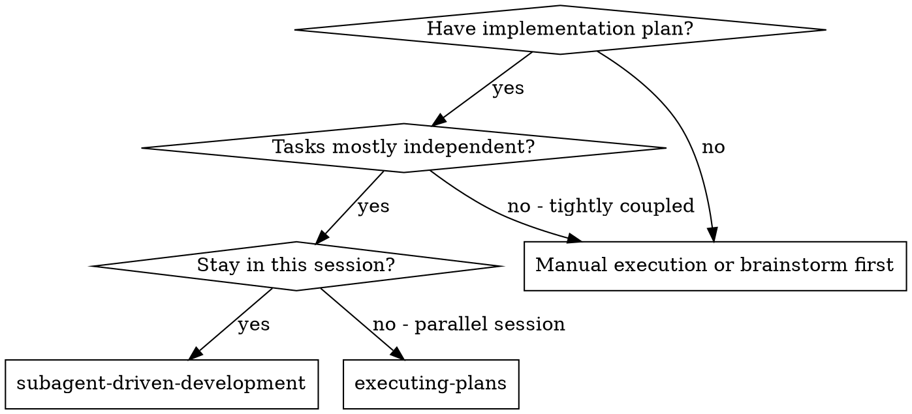

# Subagent-Driven Development

Execute plan by dispatching fresh subagent per task, with multi-stage review after each: spec compliance review first, then code quality review, then **Playwright browser evaluation for web projects**.

**Why subagents:** You delegate tasks to specialized agents with isolated context. By precisely crafting their instructions and context, you ensure they stay focused and succeed at their task. They should never inherit your session's context or history — you construct exactly what they need. This also preserves your own context for coordination work.

**Core principle:** Fresh subagent per task + multi-stage review (spec → quality → browser evaluation) = high quality, fast iteration

**Generator-Evaluator pattern:** Inspired by the Anthropic blog on autonomous development harnesses. The Generator (**Codex/GPT implementer**, dispatched via the `codex-worker` agent) builds, the Evaluator (**fresh-context Claude subagents** for spec + quality review, plus Playwright for browser testing) verifies. Using a **different model family** for evaluation eliminates self-evaluation bias completely — same property as the pre-2026-07-13 layout (Claude built, GPT reviewed), roles flipped.

**Codex CLI credit requirement:** All implementation runs through Codex CLI (via codex-worker, OpenAI billing). If credits are exhausted, ALL WORK STOPS immediately. No fallback to a Claude implementer. User must recharge OpenAI credits before proceeding. (Reviews are Claude subagents on the session's own subscription — they have no OpenAI-credit failure mode.)

## Codex invocation is encapsulated — do not call codex directly

This skill no longer contains raw `codex` commands. Every codex run goes through the **`codex-worker` agent** (`~/.claude/agents/codex-worker.md`), which owns the host-safe invocation: pinned `gpt-5.6-sol` + `max` reasoning, `-s danger-full-access` (bwrap broken here), `-c mcp_servers='{}'` (playwright wedge), `timeout -k 60 1200` (guaranteed termination), and the bounded wait loop (subagents are NOT re-invoked by background-task completion — measured 2026-07-13). If you ever need codex outside a subagent, read the `codex-cli` skill first; **never `codex review`** on this host.

## Dispatching subagents: never idle-wait

Dispatch implementer/evaluator subagents **synchronously** (wait for the Agent tool result in
the same turn). If one runs in background anyway, do NOT end your turn "to wait for it" —
measured on this host (benchmark 2026-07-02, 3 of 6 controllers stalled): a turn that ends in
"waiting for the child" just sits there until a human nudges it, and a background child often
CANNOT message you back ("No agent named ... is currently addressable"). Before ever waiting,
check the child's artifacts on disk (file mtimes, its report file) — in every observed stall
the child had already finished and written its output.

## When to Use


```dot
digraph when_to_use {
    "Have implementation plan?" [shape=diamond];
    "Tasks mostly independent?" [shape=diamond];
    "Stay in this session?" [shape=diamond];
    "subagent-driven-development" [shape=box];
    "executing-plans" [shape=box];
    "Manual execution or brainstorm first" [shape=box];

    "Have implementation plan?" -> "Tasks mostly independent?" [label="yes"];
    "Have implementation plan?" -> "Manual execution or brainstorm first" [label="no"];
    "Tasks mostly independent?" -> "Stay in this session?" [label="yes"];
    "Tasks mostly independent?" -> "Manual execution or brainstorm first" [label="no - tightly coupled"];
    "Stay in this session?" -> "subagent-driven-development" [label="yes"];
    "Stay in this session?" -> "executing-plans" [label="no - parallel session"];
}
```

**vs. Executing Plans (parallel session):**
- Same session (no context switch)
- Fresh subagent per task (no context pollution)
- Two-stage review after each task: spec compliance first, then code quality
- Faster iteration (no human-in-loop between tasks)

## Trivial tasks: batch the review, never skip it

A task that is purely mechanical — single file, no new behavior or logic (typo/comment/doc
change, a rename fully verified by the type-checker, a config value the plan fixes verbatim) —
may skip its DEDICATED per-task review rounds and fold into the next task's review or the final
whole-diff review instead. Coverage is preserved: the final Claude quality review sees every line.
Any new behavior, branching, or user-visible change → full per-task gates. When unsure, run
the gates. (This keeps SDD usable as a library for mixed-size plans instead of taxing one-line
tasks with a full review cycle.)

## The Process


```dot
digraph process {
    rankdir=TB;

    subgraph cluster_per_task {
        label="Per Task";
        "Dispatch implementer subagent (./implementer-prompt.md)" [shape=box];
        "Implementer asks questions?" [shape=diamond];
        "Answer questions, provide context" [shape=box];
        "Implementer implements, tests, commits, self-reviews" [shape=box];
        "Generate review package, dispatch Claude task reviewer (./task-reviewer-prompt.md)" [shape=box style=filled fillcolor=lightblue];
        "Codex credit error?" [shape=diamond style=filled fillcolor=red fontcolor=white];
        "HARD STOP: tell user to recharge credits" [shape=box style=filled fillcolor=red fontcolor=white];
        "Spec OK and quality approved?" [shape=diamond];
        "Finding conflicts with plan text?" [shape=diamond];
        "Ask human partner which governs" [shape=box];
        "Fix round R of 5 (re-dispatch implementer with brief+report+findings; R>=4 fresh eyes)" [shape=box];
        "Dispatch scoped Claude re-review (./re-review-prompt.md)" [shape=box style=filled fillcolor=lightblue];
        "All findings addressed?" [shape=diamond];
        "R = 5?" [shape=diamond];
        "Adjudicate each open finding" [shape=box];
        "Any load-bearing finding?" [shape=diamond];
        "STOP: report BLOCKED to human partner" [shape=box];
        "Park findings in ledger with rulings" [shape=box];
        "Task has browser-visible UI?" [shape=diamond style=filled fillcolor=lightyellow];
        "Start app, dispatch Playwright evaluator (./playwright-evaluator-prompt.md)" [shape=box style=filled fillcolor=lightyellow];
        "Playwright evaluator PASS?" [shape=diamond style=filled fillcolor=lightyellow];
        "Append completion to ledger, mark todo complete" [shape=box];
    }

    "Setup: worktree, ledger check, read plan, pre-flight review" [shape=box];
    "More tasks remain?" [shape=diamond];
    "Dispatch final Claude code reviewer (../requesting-code-review/code-reviewer.md)" [shape=box];
    "Final findings? ONE fix dispatch, one scoped re-review, adjudicate residuals" [shape=box];
    "Final BLIND Playwright evaluation of full app" [shape=box style=filled fillcolor=lightyellow];
    "Final Playwright PASS?" [shape=diamond style=filled fillcolor=lightyellow];
    "Fix and re-evaluate" [shape=box style=filled fillcolor=lightyellow];
    "Final review clean: delete this plan's workspace" [shape=box];
    "Use superpowers:finishing-a-development-branch" [shape=box style=filled fillcolor=lightgreen];

    "Setup: worktree, ledger check, read plan, pre-flight review" -> "Dispatch implementer subagent (./implementer-prompt.md)";
    "Dispatch implementer subagent (./implementer-prompt.md)" -> "Codex credit error?";
    "Codex credit error?" -> "HARD STOP: tell user to recharge credits" [label="yes"];
    "Codex credit error?" -> "Implementer asks questions?" [label="no"];
    "Implementer asks questions?" -> "Answer questions, provide context" [label="yes - NEEDS_CONTEXT report"];
    "Answer questions, provide context" -> "Dispatch implementer subagent (./implementer-prompt.md)";
    "Implementer asks questions?" -> "Implementer implements, tests, commits, self-reviews" [label="no"];
    "Implementer implements, tests, commits, self-reviews" -> "Generate review package, dispatch Claude task reviewer (./task-reviewer-prompt.md)";
    "Generate review package, dispatch Claude task reviewer (./task-reviewer-prompt.md)" -> "Spec OK and quality approved?";
    "Spec OK and quality approved?" -> "Task has browser-visible UI?" [label="yes"];
    "Spec OK and quality approved?" -> "Finding conflicts with plan text?" [label="no"];
    "Finding conflicts with plan text?" -> "Ask human partner which governs" [label="yes"];
    "Ask human partner which governs" -> "Fix round R of 5 (re-dispatch implementer with brief+report+findings; R>=4 fresh eyes)";
    "Finding conflicts with plan text?" -> "Fix round R of 5 (re-dispatch implementer with brief+report+findings; R>=4 fresh eyes)" [label="no"];
    "Fix round R of 5 (re-dispatch implementer with brief+report+findings; R>=4 fresh eyes)" -> "Dispatch scoped Claude re-review (./re-review-prompt.md)";
    "Dispatch scoped Claude re-review (./re-review-prompt.md)" -> "All findings addressed?";
    "All findings addressed?" -> "Task has browser-visible UI?" [label="yes"];
    "All findings addressed?" -> "R = 5?" [label="no"];
    "R = 5?" -> "Fix round R of 5 (re-dispatch implementer with brief+report+findings; R>=4 fresh eyes)" [label="no - next round"];
    "R = 5?" -> "Adjudicate each open finding" [label="yes - breaker trips"];
    "Adjudicate each open finding" -> "Any load-bearing finding?";
    "Any load-bearing finding?" -> "STOP: report BLOCKED to human partner" [label="yes"];
    "Any load-bearing finding?" -> "Park findings in ledger with rulings" [label="no"];
    "Park findings in ledger with rulings" -> "Task has browser-visible UI?";
    "Task has browser-visible UI?" -> "Start app, dispatch Playwright evaluator (./playwright-evaluator-prompt.md)" [label="yes - task touches UI"];
    "Task has browser-visible UI?" -> "Append completion to ledger, mark todo complete" [label="no - backend/data/infra only"];
    "Start app, dispatch Playwright evaluator (./playwright-evaluator-prompt.md)" -> "Playwright evaluator PASS?";
    "Playwright evaluator PASS?" -> "Append completion to ledger, mark todo complete" [label="PASS"];
    "Playwright evaluator PASS?" -> "Fix round R of 5 (re-dispatch implementer with brief+report+findings; R>=4 fresh eyes)" [label="FAIL - findings join the loop"];
    "Append completion to ledger, mark todo complete" -> "More tasks remain?";
    "More tasks remain?" -> "Dispatch implementer subagent (./implementer-prompt.md)" [label="yes"];
    "More tasks remain?" -> "Dispatch final Claude code reviewer (../requesting-code-review/code-reviewer.md)" [label="no"];
    "Dispatch final Claude code reviewer (../requesting-code-review/code-reviewer.md)" -> "Final findings? ONE fix dispatch, one scoped re-review, adjudicate residuals";
    "Final findings? ONE fix dispatch, one scoped re-review, adjudicate residuals" -> "Final BLIND Playwright evaluation of full app";
    "Final BLIND Playwright evaluation of full app" -> "Final Playwright PASS?";
    "Final Playwright PASS?" -> "Final review clean: delete this plan's workspace" [label="PASS"];
    "Final Playwright PASS?" -> "Fix and re-evaluate" [label="FAIL"];
    "Fix and re-evaluate" -> "Final BLIND Playwright evaluation of full app";
    "Final review clean: delete this plan's workspace" -> "Use superpowers:finishing-a-development-branch";
}
```

## Setup

Ensure the work happens in an isolated workspace: use
superpowers:using-git-worktrees to create one or verify the existing one.
Never start implementation on a main/master branch without your human
partner's explicit consent.

Conversation memory does not survive compaction. In real sessions,
controllers that lost their place have re-dispatched entire completed task
sequences — the single most expensive failure observed. Track progress in
a ledger file, not only in todos.

- Each plan owns a workspace: at skill start, run this skill's
  `scripts/sdd-workspace PLAN_FILE` — it prints the plan's git-ignored
  directory (`<repo-root>/.superpowers/sdd/<plan-basename>/`), home to
  every artifact for THIS plan: ledger, briefs, reports, review packages.
  Another plan's directory is never yours to read or write.
- Check for this plan's ledger at `<workspace>/progress.md`. If its first
  line names your plan file, tasks with a `Task <N>: complete` line are DONE
  — do not re-dispatch them; resume at the first task without one. A task
  whose last line is a fix round is mid-loop: resume the loop at the next
  round. A ledger whose first line names a different plan file — or a stray
  ledger at the old flat path `.superpowers/sdd/progress.md` — is another
  plan's progress: leave it in place and start your own, fresh.
- Create the ledger with its identity as the first line:
  `# SDD ledger — plan: <plan file path>`.
- The ledger is your recovery map: the commits it names exist in git even
  when your context no longer remembers creating them. After compaction,
  trust the ledger and `git log` over your own recollection.
- `git clean -fdx` will destroy the workspace (it's git-ignored scratch); if
  that happens, recover from `git log`.

Read the plan once, note its context and Global Constraints, and create a
todo per task.

Before dispatching Task 1, scan the plan once for conflicts:

- tasks that contradict each other or the plan's Global Constraints
- anything the plan explicitly mandates that the review rubric treats as a
  defect (a test that asserts nothing, verbatim duplication of a logic block)

Present everything you find to your human partner as one batched question —
each finding beside the plan text that mandates it, asking which governs —
before execution begins, not one interrupt per discovery mid-plan. If the
scan is clean, proceed without comment. The review loop remains the net for
conflicts that only emerge from implementation.

## Model Selection

**Generator (Codex/GPT):** the codex-worker agent pins `gpt-5.6-sol` at `max` reasoning on every dispatch — there is no per-task model tuning. The sizing lever is the TASK, not the model: a task that over-runs codex-worker's 20-min ceiling comes back as exit 124 → split it into smaller tasks and re-dispatch.

**Evaluator (Claude reviewers):** fresh-context `general-purpose` subagents inheriting the session model. Do not review in the controller's own context — the controller watched the implementation happen and is biased.

**Playwright Evaluator:** Uses Claude (inherits parent model) — it needs Playwright MCP tools, which codex can't use here (codex runs MCP-less on this host by design).

**Integration and judgment tasks** (multi-file coordination, pattern matching, debugging): use a standard model.

**Architecture and design tasks**: use the most capable available model.
The final whole-branch review is one of these — dispatch it on the most
capable available model, not the session default.

**Review tasks**: choose the model with the same judgment, scaled to the
diff's size, complexity, and risk. A small mechanical diff does not need the
most capable model; a subtle concurrency change does. Scoped re-reviews of
small fix diffs take a cheap-to-mid tier.

**Fix-loop escalation (rounds 4-5)**: use a model at least one tier above
the implementer that got stuck.

**Always specify the model explicitly when dispatching a subagent.** An
omitted model inherits your session's model — often the most capable and
most expensive — which silently defeats this section.

**Turn count beats token price.** Wall-clock and context cost scale with how
many turns a subagent takes, and the cheapest models routinely take 2-3× the
turns on multi-step work — costing more overall. Use a mid-tier model as the
floor for reviewers and for implementers working from prose descriptions.
When the task's plan text contains the complete code to write, the
implementation is transcription plus testing: use the cheapest tier for
that implementer. Single-file mechanical fixes also take the cheapest tier.

**Task complexity signals (implementation tasks):**
- Touches 1-2 files with a complete spec → cheap model
- Touches multiple files with integration concerns → standard model
- Requires design judgment or broad codebase understanding → most capable model

## The Task Loop

Everything you paste into a dispatch prompt — and everything a subagent
prints back — stays resident in your context for the rest of the session
and is re-read on every later turn. Hand artifacts over as files.

### 1. Dispatch the implementer

Record BASE (`git rev-parse HEAD`) before dispatching — the review package
and fix-round diffs need it.

- **Task brief:** before dispatching an implementer, run this skill's
  `scripts/task-brief PLAN_FILE N` — it extracts the task's full text to a
  uniquely named file and prints the path. Compose the dispatch so the
  brief stays the single source of
  requirements. Your dispatch should contain: (1) one line on where this
  task fits in the project; (2) the brief path, introduced as "read this
  first — it is your requirements, with the exact values to use verbatim";
  (3) interfaces and decisions from earlier tasks that the brief cannot
  know; (4) your resolution of any ambiguity you noticed in the brief;
  (5) the report-file path and report contract. Exact values (numbers,
  magic strings, signatures, test cases) appear only in the brief. Never
  make a subagent read the whole plan file.
- **Report file:** name the implementer's report file after the brief
  (brief `…/task-N-brief.md` → report `…/task-N-report.md`) and put it in
  the dispatch prompt. The implementer writes the full report there and
  returns only status, commits, a one-line test summary, and concerns.
- A dispatch prompt describes one task, not the session's history. Do not
  paste accumulated prior-task summaries ("state after Tasks 1-3") into
  later dispatches — a real session's dispatch hit 42k chars of which 99%
  was pasted history. A fresh subagent needs its task, the interfaces it
  touches, and the global constraints. Nothing else.
- If an earlier task parked a finding in the area this task touches, carry
  a pointer to that ledger entry in the dispatch.
- Record the brief path and the report-file path — every fix round
  re-dispatches a fresh codex-worker carrying both. There is no agent
  identity to resume on this host.
- Never dispatch multiple implementation subagents in parallel (conflicts).

Template: [implementer-prompt.md](implementer-prompt.md)

### 2. Handle the report

Implementer subagents report one of four statuses. Handle each appropriately:

**DONE:** Generate the review package (`scripts/review-package PLAN_FILE BASE HEAD`, from this skill's directory — it prints the unique file path it wrote; BASE is the commit you recorded before dispatching the implementer — never `HEAD~1`, which silently drops all but the last commit of a multi-commit task), then dispatch the task reviewer with the printed path.

**DONE_WITH_CONCERNS:** The implementer completed the work but flagged doubts. Read the concerns before proceeding. If the concerns are about correctness or scope, address them before review. If they're observations (e.g., "this file is getting large"), note them and proceed to review.

**NEEDS_CONTEXT:** The implementer needs information that wasn't provided. Provide the missing context and re-dispatch.

**BLOCKED:** The implementer cannot complete the task. Assess the blocker:
1. FIRST verify the dispatch carried the FULL task spec, acceptance criteria, and every file/context reference it needs — measured on this host, incomplete subagent output almost always traces to an incomplete spec reaching the subagent, not to model capability (effort/model A/B showed no completeness difference on well-specified tasks). Fix the spec and re-dispatch. Remember codex has NO memory of previous runs — a re-dispatch must carry the original spec plus the new context.
2. If the task is too large (or codex-worker returned exit 124), break it into smaller pieces
3. For genuinely ambiguous architectural work: make the decision yourself (controller) or escalate to the human — the implementer is already at max reasoning; there is no bigger model to throw at it
4. If the plan itself is wrong, escalate to the human

**Never** ignore an escalation or force the same model to retry without changes. If the implementer said it's stuck, something needs to change.

If the implementer asks questions — before starting or mid-task — answer
clearly and completely, provide additional context if needed, and don't
rush it into implementation.

### 3. Review the task

Per-task reviews are task-scoped gates. The broad review happens once, at the
final whole-branch review. Never skip the task review, and never accept a
report missing either verdict — spec compliance AND task quality are both
required. Implementer self-review never replaces the task review; both are
needed.

- Hand the reviewer its diff as a file: run this skill's
  `scripts/review-package PLAN_FILE BASE HEAD` and pass the reviewer the file path
  it prints (or, without bash: `git log --oneline`, `git diff --stat`,
  and `git diff -U10` for the range, redirected to one uniquely named
  file). The output never enters your own context, and the reviewer sees
  the commit list, stat summary, and full diff with context in one Read
  call. Use the BASE you recorded before dispatching the implementer —
  never `HEAD~1`, which silently truncates multi-commit tasks. Never
  dispatch a task reviewer without a diff file.
- **Reviewer inputs:** the task reviewer gets three paths — the same brief
  file, the report file, and the review package — plus the global
  constraints that bind the task.
- The global-constraints block you hand the reviewer is its attention
  lens. Copy the binding requirements verbatim from the plan's Global
  Constraints section or the spec: exact values, exact formats, and the
  stated relationships between components ("same layout as X", "matches
  Y"). The reviewer's template already carries the process rules (YAGNI,
  test hygiene, review method) — the constraints block is for what THIS
  project's spec demands.
- Do not add open-ended directives like "check all uses" or "run race tests
  if useful" without a concrete, task-specific reason
- Do not ask a reviewer to re-run tests the implementer already ran on the
  same code — the implementer's report carries the test evidence
- Do not pre-judge findings for the reviewer — never instruct a reviewer to
  ignore or not flag a specific issue. If you believe a finding would be a
  false positive, let the reviewer raise it and adjudicate it in the review
  loop. If the prompt you are writing contains "do not flag," "don't treat X
  as a defect," "at most Minor," or "the plan chose" — stop: you are
  pre-judging, usually to spare yourself a review loop.
The task reviewer may report "⚠️ Cannot verify from diff" items — requirements
that live in unchanged code or span tasks. These do not block the rest of the
review, but you must resolve each one yourself before marking the task
complete: you hold the plan and cross-task context the reviewer
lacks. If you confirm an item is a real gap, treat it as a failed spec
review — it enters the fix loop with the other findings.

Template: [task-reviewer-prompt.md](task-reviewer-prompt.md)

### 4. The fix loop

The loop triggers when the review reports spec ❌, any Critical or Important
finding, or a ⚠️ item you confirmed as a real gap.

Before the loop starts, two routes leave it immediately:

- Record Minor findings in the progress ledger as you go
  (`Task <N>: minor (deferred): <one-liner>`), and point the final
  whole-branch review at that list so it can triage which must be fixed
  before merge. A roll-up nobody reads is a silent discard. Minor findings
  never enter the loop.
- A finding labeled plan-mandated — or any finding that conflicts with
  what the plan's text requires — is the human's decision, like any plan
  contradiction: present the finding and the plan text, ask which governs.
  Do not dismiss the finding because the plan mandates it, and do not
  dispatch a fix that contradicts the plan without asking.
Everything else enters the loop. A fix round is one fix dispatch plus one
scoped re-review. Five rounds maximum per task:

**On this host there is no resume.** `codex-worker` is one-shot — codex has
NO memory of previous runs, and a spawned subagent cannot be messaged again.
Every round re-dispatches a fresh implementer carrying the brief path, the
report-file path, and the open findings verbatim. The report file is the
persistent memory; that is exactly what it is for.

**Rounds 1-3 — re-dispatch with the findings.** The fresh implementer reads
the brief for requirements and the report file for what was already tried,
then fixes the open findings.

**Rounds 4-5 — re-dispatch with fresh-eyes framing.** Same mechanics, plus:
"A prior implementer attempted this task [N] times; you own it now. Read the
report file for what was tried." A loop that survives three rounds usually
means the implementer cannot see its own problem — say so explicitly rather
than sending the same findings a fourth time unchanged. (Model escalation is
not a lever here: codex-worker is already pinned at `gpt-5.6-sol` / `max`.
If three rounds fail, the task is mis-scoped or the plan is wrong — split it
or escalate to your human partner.)

**Every round, either way:** the implementer fixes, re-runs the tests
covering the amended code, appends its fix report to the same report file,
and returns the short contract. Before re-dispatching the reviewer, confirm
the fix report contains the covering tests, the command run, and the
output; dispatch the re-review once all three are present. Name the
covering test files in the fix message — a one-line fix does not need the
whole suite.

**The re-review is scoped.** Run `scripts/review-package PLAN_FILE FIX_BASE HEAD`
where FIX_BASE is the head the previous review saw, and dispatch
[re-review-prompt.md](re-review-prompt.md) with the findings list, the
brief, the report file, and the printed diff path. The re-reviewer verdicts
each finding ADDRESSED or NOT ADDRESSED and flags new breakage in the fix
diff only. New Critical/Important breakage in the fix diff joins the open
findings list. Out-of-scope observations go to the ledger as deferred
minors — they never extend the loop.

**After each round,** append to the ledger:
`Task <N>: fix round <R>/5 (<X> addressed, <Y> open — <finding one-liners>; commits <a7>..<b7>)`

Never fix findings yourself in the controller session — your context stays
clean for coordination, and controller fixes skip review.

**The breaker.** When round 5's re-review still leaves findings open, stop
dispatching. Adjudicate each open finding yourself — you hold the plan and
the cross-task context the reviewer lacks:

- **The reviewer is wrong, or the point is contestable:** park it —
  `Task <N>: parked — <finding> — ruling: <why the code stands>`. The final
  review sees both sides.
- **Real, but nothing downstream builds on it:** park it the same way, with
  a ruling that says it's real and deferred.
- **Real and load-bearing** — a later task builds on it, or it reveals a
  plan defect: STOP. Append `Task <N>: BLOCKED — <reason>` and report to
  your human partner with the finding, the plan text it collides with, and
  the fix history. Parking a structural failure lets every dependent task
  build on it and hands the final review a problem it cannot fix either.

Adjudicate only at the cap. Adjudicating earlier to end a loop is
pre-judging with a different name. Every adjudication is a ledger entry —
a silent discard is forbidden.

### 5. Complete the task

When the review comes back clean — or every open finding is parked with a
ruling at the cap — append the completion line to the ledger in the same
message as your other bookkeeping:

- `Task <N>: complete (commits <base7>..<head7>, review clean)`
- `Task <N>: complete (commits <base7>..<head7>, <K> parked)` after a
  tripped breaker

Then mark the todo complete and move on. Never move to the next task while
the review has open Critical/Important issues that are neither fixed nor
parked-with-ruling at the cap.

## Final Review

The final whole-branch review gets a package too: run
`scripts/review-package PLAN_FILE MERGE_BASE HEAD` (MERGE_BASE = the commit the
branch started from, e.g. `git merge-base main HEAD`) and include the
printed path in the final review dispatch, so the final reviewer reads
one file instead of re-deriving the branch diff with git commands. Dispatch
on the most capable available model (see Model Selection), using
superpowers:requesting-code-review's
[code-reviewer.md](../requesting-code-review/code-reviewer.md). Point it at
the ledger's deferred-minor and parked lines so it can triage which must be
fixed before merge.

If the final whole-branch review returns findings, dispatch ONE fix subagent
with the complete findings list — not one fixer per finding.
Per-finding fixers each rebuild context and re-run suites; a real
session's final-review fix wave cost more than all its tasks combined.
Then run exactly one scoped re-review of the fix wave
(`scripts/review-package PLAN_FILE FIX_BASE HEAD` over the fix range,
[re-review-prompt.md](re-review-prompt.md)).
Adjudicate any residual findings as in the task loop's breaker: park with
rulings, or stop on load-bearing ones. There is no second fix wave —
residual load-bearing findings surface to your human partner when
finishing-a-development-branch presents the options.

## Finish

When the final whole-branch review is clean and its fixes are merged,
delete this plan's workspace (`rm -rf <workspace>`) — the git history is
the record now. Sibling directories belong to other plans; leave them
alone.

Use superpowers:finishing-a-development-branch.

## Common Rationalizations

| Excuse | Reality |
|--------|---------|
| "Close enough on spec compliance" | Reviewer found spec gaps = not done. Fix or hit the cap and adjudicate — those are the only exits. |
| "I'll fix it myself, dispatching is overhead" | Controller fixes pollute your context and skip review. Resume the implementer. |
| "One more round will converge" | Past the cap, rounds don't converge — the failure is structural. Adjudicate and route. |
| "The reviewer will just find something new anyway" | Scoped re-reviews verify fixes; they cannot wander. New findings on untouched code go to the ledger, not the loop. |
| "This finding is obviously wrong, I'll drop it" | You adjudicate only at the cap, and every ruling is a ledger entry. Silent discards are forbidden. |
| "The fix was small, skip the re-review" | Unreviewed fixes are how regressions land. Every round ends with a scoped re-review. |
| "Reviews slow the loop down" | The loop without reviews is just unverified churn. Reviews are the loop's brakes and steering. |
| "Ledger bookkeeping is overhead" | The ledger is what survives compaction. Controllers without one have re-dispatched entire completed task sequences. |

## Prompt Templates

- `./implementer-prompt.md` - Dispatch codex-worker implementer subagent (Generator, GPT)
- `./task-reviewer-prompt.md` - Dispatch Claude task reviewer — spec compliance AND code quality in one pass (Evaluator). This is the default per-task gate.
- `./re-review-prompt.md` - Dispatch Claude scoped re-review of a fix round (Evaluator)
- `./playwright-evaluator-prompt.md` - Dispatch Playwright browser evaluator (Evaluator, web projects only)
- `./flutter-evaluator-prompt.md` - Dispatch Flutter device evaluator (Evaluator, Flutter projects only)
- `../requesting-code-review/code-reviewer.md` - Final whole-branch Claude review

**Split-review variants:** `./spec-reviewer-prompt.md` and
`./code-quality-reviewer-prompt.md` run the same rubric as two sequential
dispatches — spec first, quality second. Use them when one task's diff is
large enough to strain a single reviewer's context. The single-pass task
reviewer is the default; either way, both verdicts are mandatory.

**Generator = Codex/GPT** (writes code, via codex-worker) | **Evaluator = Claude** (reviews code) + **Playwright** (web UI) + **Flutter Evaluator** (mobile UI)

## Web Project Detection

A project is a "web project" if ANY of these are true:
- Has `.jsx`, `.tsx`, `.vue`, `.svelte`, or `.html` files being modified
- Uses React, Vue, Svelte, Next.js, Nuxt, SvelteKit, or similar frameworks
- Has a frontend dev server (Vite, Webpack, etc.)
- Task involves UI components, pages, layouts, or user-facing features
- Plan mentions "frontend", "UI", "dashboard", "web app", or similar

**When detected as web project:**
1. Ensure dev server is started before Playwright evaluation
2. Playwright evaluation applies **per-task only when the task has browser-visible UI changes** (components, pages, layouts, styles, user interactions)
3. Tasks that are backend-only, data layer, or infrastructure (e.g., "Todo Store", "API routes", "database schema") skip Playwright — unit/integration tests are sufficient
4. Final Playwright evaluation covers the **entire app** after all tasks complete — this one is always mandatory, and it must run as a BLIND checker per web-app-evaluation §"Final signoff must be a BLIND checker": operationalized checklist + fresh evaluator with no task history or project access (measured 2026-07-02: internal gates passed defects an independent checker caught instantly)
5. The evaluator tests at mobile, tablet, and desktop viewports

**Per-task Playwright trigger:** Does this specific task produce something a user can see or interact with in the browser? If yes → Playwright. If no → skip to mark complete.

## Flutter Project Detection

A project is a "Flutter project" if:
- Has `pubspec.yaml` with `flutter` SDK dependency
- Has `.dart` files in `lib/` directory being modified
- Has `android/` and/or `ios/` directories
- Plan mentions "Flutter", "mobile app", "widget"

**When detected as Flutter project:**
1. Ensure emulator (Android) and/or simulator (iOS) is running
2. Flutter evaluation applies **per-task only when the task has user-visible UI changes**
3. Tasks that are data layer, repository, or business logic only skip Flutter eval
4. Final Flutter evaluation covers the **entire app** on all available platforms
5. The evaluator tests rotation, dark mode, and platform-specific behavior

**Per-task Flutter trigger:** Does this specific task produce something a user can see or interact with on the device? If yes → Flutter Evaluator. If no → skip.

**Web vs Flutter:** If the project is Flutter Web, use Playwright. If native Android/iOS, use Flutter Evaluator. If both, use both.

## Example Workflow (Non-Web Project)

```
You: I'm using Subagent-Driven Development to execute this plan.

[Setup: worktree verified]
[Read plan file once: docs/superpowers/plans/feature-plan.md]
[Resolve workspace: scripts/sdd-workspace docs/superpowers/plans/feature-plan.md — no ledger inside, fresh start]
[Detect: No web UI files -> skip Playwright evaluation]
[Create todos for all tasks]

Task 1: Hook installation script

[Dispatch codex-worker implementer subagent]
Implementer (GPT): NEEDS_CONTEXT — "hooks at user level or project level?"

You: "User level (~/.config/superpowers/hooks/)"

[Re-dispatch codex-worker — the original spec plus the answer; codex has no
 memory of the first run]
Implementer (GPT): DONE
  - Implemented install-hook command
  - Added tests, 5/5 passing
  - Self-review: found I missed --force flag, added it
  - Committed

[Run review-package PLAN_FILE BASE HEAD; dispatch Claude task reviewer with the printed path]
Task reviewer: Spec ✅ - all requirements met, nothing extra.
  Strengths: Good test coverage, clean. Issues: None. Task quality: Approved.

[Ledger: Task 1: complete (commits a1b2c3d..d4e5f6a, review clean)]

Task 2: Recovery modes

[Dispatch codex-worker implementer]
Implementer: [No questions]
  - Added verify/repair modes
  - 8/8 tests passing
  - Committed

[Run review-package PLAN_FILE BASE HEAD; dispatch task reviewer with the printed path]
Task reviewer: Spec ❌:
  - Missing: Progress reporting (spec says "report every 100 items")
  Issues (Important): Magic number (100)

[Fix round 1: re-dispatch codex-worker with the brief, the report file, and both findings]
Implementer: Added progress reporting, extracted PROGRESS_INTERVAL constant.
  Re-ran test/recovery.test.js — 10/10 passing. Fix report appended.

[Run review-package PLAN_FILE FIX_BASE HEAD; dispatch scoped re-review]
Re-reviewer: Missing progress reporting — ADDRESSED (src/recovery.js:41).
  Magic number — ADDRESSED (src/recovery.js:7). New breakage: none.
  Verdict: all findings addressed.

[Ledger: Task 2: fix round 1/5 (2 addressed, 0 open; commits d4e5f6a..b7c8d9e)]
[Ledger: Task 2: complete (commits d4e5f6a..b7c8d9e, review clean)]

...

[After all tasks]
[Run review-package PLAN_FILE MERGE_BASE HEAD; dispatch final code-reviewer, most capable model]
Final reviewer: All requirements met. Deferred minors triaged: none block merge.

[Delete this plan's workspace — the record now lives in git]

Done! Using superpowers:finishing-a-development-branch.
```

## Example Workflow (Web Project — with Claude reviews + Playwright)

```
You: I'm using Subagent-Driven Development to execute this plan.

[Read plan file once: docs/superpowers/plans/dashboard-plan.md]
[Detect: React + Vite → Claude reviews MANDATORY + Playwright evaluation MANDATORY]
[Create TodoWrite with all tasks]

Task 1: User dashboard page

[Dispatch codex-worker implementer subagent]
Implementer (GPT):
  - Built Dashboard component with user stats cards
  - Added API route /api/stats
  - 6/6 tests passing, committed

[Dispatch Claude spec reviewer subagent]
Claude reviewer: status: APPROVED

[Dispatch Claude quality reviewer subagent]
Claude reviewer: status: APPROVED — strengths: clean components; issues: none

[Web project → Start dev server: npm run dev]
[Dispatch Playwright evaluator at http://localhost:5173]

Playwright Evaluator:
  verdict: FAIL
  findings:
    - [blocking] Stats cards have no loading state (shows "undefined" briefly)
    - [minor] No error state when API fails

[Dispatch codex-worker fix round: adds loading skeleton + error state]
[Re-dispatch Playwright evaluator]

Playwright Evaluator:
  verdict: PASS

[Mark Task 1 complete]

...

## Example: Credit Exhausted — HARD STOP

Task 3: Settings page

[Dispatch codex-worker implementer]
codex-worker: [codex gpt-5.6-sol / effort max / exit 1] ERROR: insufficient_quota — check billing

⛔ HARD STOP

You: "Codex CLI 크레딧이 소진되었습니다.
구현을 Claude로 대체할 수 없으므로 작업을 즉시 중단합니다.
OpenAI 계정에서 크레딧을 충전해주세요: https://platform.openai.com/account/billing
충전 완료 후 알려주시면 Task 3 구현부터 이어서 진행하겠습니다."

[WAIT for user confirmation — do NOT proceed]
```

## Advantages

**vs. Manual execution:**
- Subagents follow TDD naturally
- Fresh context per task (no confusion)
- Parallel-safe (subagents don't interfere)
- Subagent can ask questions (one-shot: unclear spec comes back as a NEEDS_CONTEXT report → answer and re-dispatch)

**vs. Executing Plans:**
- Same session (no handoff)
- Continuous progress (no waiting)
- Review checkpoints automatic

**Efficiency gains:**
- No file reading overhead (controller provides full text)
- Controller curates exactly what context is needed
- Subagent gets complete information upfront
- Questions surfaced before work begins (not after)

**Quality gates:**
- Self-review catches issues before handoff
- Multi-stage review: spec compliance → code quality → Playwright browser evaluation
- Review loops ensure fixes actually work
- Spec compliance prevents over/under-building
- Code quality ensures implementation is well-built
- Playwright evaluation catches what code review cannot: visual bugs, broken interactions, missing states

**Cost:**
- More subagent invocations (implementer + 2-3 reviewers per task)
- Controller does more prep work (extracting all tasks upfront)
- Review loops add iterations
- Playwright evaluation adds browser interaction time
- But catches issues early (cheaper than debugging later)
- From Anthropic's data: ~20x cost increase yields fundamental quality difference

## Red Flags

**Never:**
- Start implementation on main/master branch without explicit user consent
- Skip reviews (spec compliance OR code quality OR Playwright for web projects)
- Skip Playwright evaluation for web projects ("code review is enough" — NO, it is NOT)
- Proceed with unfixed issues
- Dispatch multiple implementation subagents in parallel (conflicts)
- Make subagent read plan file (provide full text instead)
- Skip scene-setting context (subagent needs to understand where task fits)
- Ignore subagent questions (answer before letting them proceed)
- Accept "close enough" on spec compliance (spec reviewer found issues = not done)
- Skip review loops (reviewer found issues = implementer fixes = review again)
- Let implementer self-review replace actual review (both are needed)
- **Start code quality review before spec compliance is ✅** (wrong order)
- Move to next task while either review has open issues

**If subagent asks questions:**
- Answer clearly and completely
- Provide additional context if needed
- Don't rush them into implementation

**If reviewer finds issues:**
- Implementer (same subagent) fixes them
- Reviewer reviews again
- Repeat until approved
- Don't skip the re-review

**If subagent fails task:**
- Dispatch fix subagent with specific instructions
- Don't try to fix manually (context pollution)

## Integration

**Required workflow skills:**
- **superpowers:using-git-worktrees** - RECOMMENDED: isolated workspace before starting (honors user consent; may work in place if the user declines)
- **superpowers:writing-plans** - Creates the plan this skill executes
- **codex-worker agent** (`~/.claude/agents/codex-worker.md`) - REQUIRED: GPT implementer (must have OpenAI credits)
- **superpowers:web-app-evaluation** - REQUIRED for web projects: Playwright browser evaluation
- **superpowers:finishing-a-development-branch** - Complete development after all tasks

**Generator tool:**
- **codex-worker agent** - Implementation via GPT `gpt-5.6-sol` @ max reasoning; owns the host-safe codex invocation (never call `codex` directly from this skill)

**Evaluator tools:**
- **Claude reviewer subagents** (fresh context, `general-purpose`) - Spec + quality review via `./spec-reviewer-prompt.md` / `./code-quality-reviewer-prompt.md` (different model family than the GPT implementer = no self-evaluation bias)
- **superpowers:playwright-evaluator** - Browser-based UI evaluation agent (web projects only)
- **superpowers:flutter-evaluator** - Emulator/simulator-based evaluation agent (Flutter projects only)

**Prerequisites:**
- OpenAI API credits must be available for Codex CLI (implementation side)
- If credits run out mid-workflow: HARD STOP, no exceptions

**Alternative workflow:**
- **superpowers:executing-plans** - Use for parallel session instead of same-session execution
