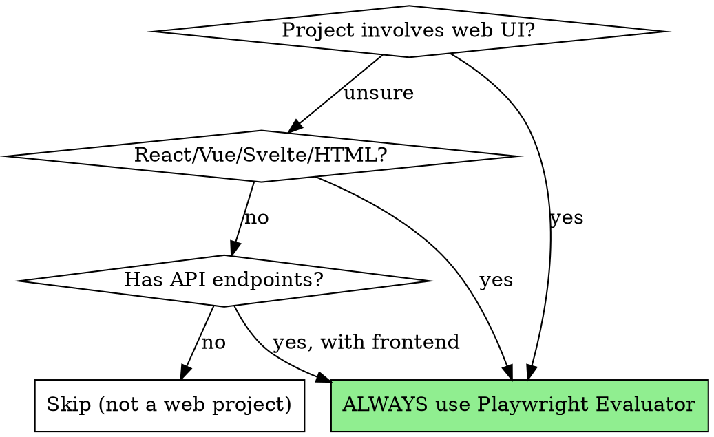
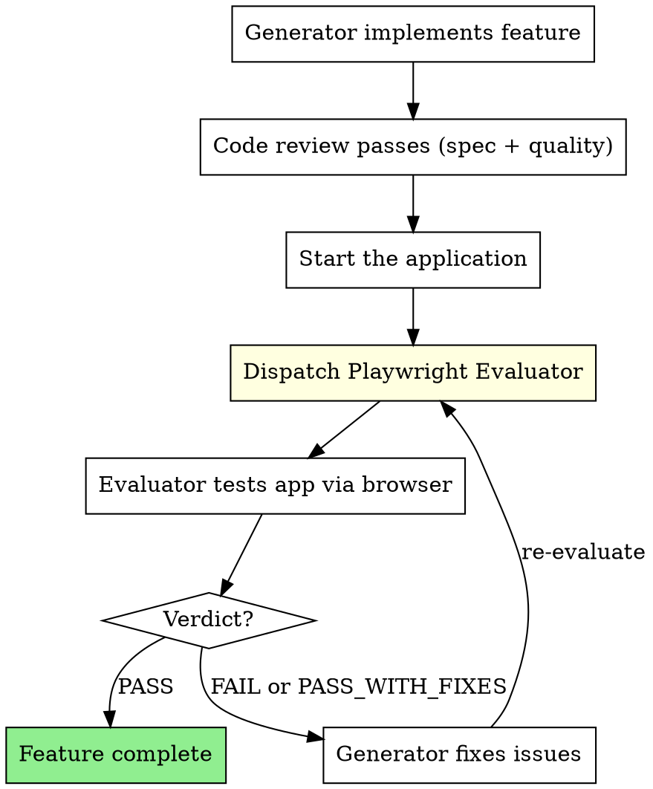

# Web App Evaluation

Every web feature must be verified by a Playwright Evaluator that interacts with the running application like a real user. Code review alone is insufficient — the app must be clicked, navigated, and tested in a browser.

**Core principle:** If a user can't click it and see it work, it's not done.

**This is non-negotiable for web projects.**

## When This Applies



**Detection signals** (any one triggers this skill):
- Project uses React, Vue, Svelte, Next.js, Nuxt, SvelteKit, Vite, Webpack, or similar
- Files with `.jsx`, `.tsx`, `.vue`, `.svelte`, `.html` extensions
- Package.json contains frontend dependencies
- Project has API routes or endpoints with a UI consumer
- User mentions "web app", "frontend", "UI", "dashboard", "page", "component"

## The Evaluation Loop



## How to Dispatch the Evaluator

### Step 1: Ensure the app is running

Before dispatching the evaluator, the application MUST be running. Start it:

```bash
# Example for typical stacks
npm run dev &          # React/Vue/Svelte
python -m uvicorn main:app &  # FastAPI
# Wait for server to be ready
sleep 3
```

Capture the URL (typically `http://localhost:3000` or `http://localhost:5173`).

### Step 2: Dispatch Playwright Evaluator

```
Agent tool (superpowers:playwright-evaluator):
  description: "Evaluate web app: [feature name]"
  prompt: |
    Evaluate the running web application.

    ## App URL
    [URL where app is running, e.g. http://localhost:5173]

    ## What Was Built
    [Description of the feature/page/flow to evaluate]

    ## Requirements
    [What the feature should do — from the plan or spec]

    ## Specific Things to Test
    - [Feature 1: expected behavior]
    - [Feature 2: expected behavior]
    - [Edge case to try]

    Follow the evaluation process in your agent instructions.
    Test everything. Take screenshots. Be skeptical.
```

### Step 3: Act on the Verdict

| Verdict | Action |
|---------|--------|
| **PASS** | Feature is genuinely complete. Proceed. |
| **PASS_WITH_FIXES** | Fix Important issues, then re-evaluate. Minor issues can be noted for later. |
| **FAIL** | Fix Critical issues, then re-evaluate from scratch. |

### Step 4: Re-evaluation

After Generator fixes issues:
1. Verify the app is still running (restart if needed)
2. Dispatch Evaluator again with the SAME requirements
3. Include "Previously found issues: [list]" so evaluator can verify fixes
4. Repeat until PASS

## Integration with Subagent-Driven Development

When using `subagent-driven-development` for a web project, the flow becomes:

```
Per Task:
1. Implementer subagent builds feature
2. Spec reviewer verifies requirements ✅
3. Code quality reviewer verifies code ✅
4. START APP if not running
5. Playwright Evaluator verifies in browser ✅  ← NEW STEP
6. Mark task complete
```

**The Playwright evaluation step is MANDATORY for web projects.** It is NOT optional. It is NOT "nice to have". Code that passes review but fails in the browser is broken code.

## What the Evaluator Checks

### UI Functionality
- Every button works when clicked
- Forms submit and validate correctly
- Navigation flows are intuitive
- Loading states appear when expected
- Error states display properly

### Visual Quality
- Consistent spacing, typography, colors
- No layout shifts or overflow issues
- Responsive at mobile/tablet/desktop
- No broken images or missing assets

### API Integration
- Network requests succeed (check via Playwright network inspection)
- Data displays correctly after API calls
- Error responses are handled gracefully
- Loading states during API calls

### State & Data
- Data persists after page refresh (if it should)
- State updates correctly after user actions
- Database writes actually happened (verify via API or JS evaluation)
- No stale data displayed

## Red Flags

**Never:**
- Skip Playwright evaluation for web projects ("code review is enough")
- Trust the Generator's claim that "it works" without browser verification
- Give PASS verdict while any Critical issue exists
- Skip mobile responsive testing
- Ignore console errors ("they're just warnings")
- Assume the app started correctly without verifying

**If app won't start:**
- Check build errors
- Check port conflicts
- Report as Critical blocker — can't evaluate what can't run

## Why This Matters

From the Anthropic blog post on Generator-Evaluator patterns:
> "If you ask the agent to evaluate its own output, it tends to confidently praise results even when quality is clearly mediocre."

The Evaluator exists because:
1. Code that looks correct can behave incorrectly
2. Visual quality requires actually seeing the UI
3. User flows require actually clicking through them
4. API integration requires actually making the requests
5. The Generator is biased toward its own work
