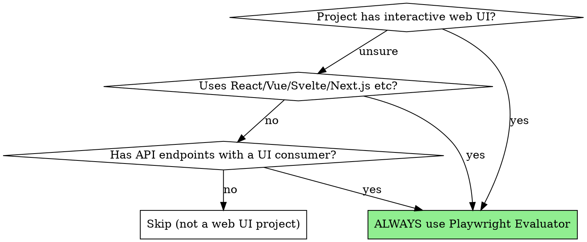
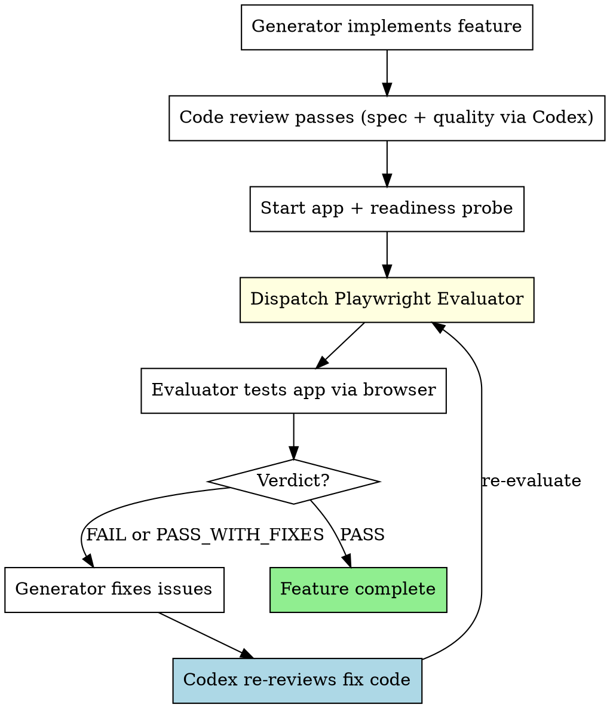

# Web App Evaluation

Every web feature with browser-visible UI must be verified by a Playwright Evaluator that interacts with the running application like a real user. Code review alone is insufficient — the app must be clicked, navigated, and tested in a browser.

**Core principle:** If a user can't click it and see it work, it's not done.

**This is non-negotiable for web projects with UI.**

## When This Applies



**Detection signals** (need at least 2, or 1 strong signal):
- Project uses React, Vue, Svelte, Next.js, Nuxt, SvelteKit with a dev server
- Active `.jsx`, `.tsx`, `.vue`, `.svelte` component files being modified
- User mentions "web app", "frontend", "UI", "dashboard", "page" in the context of an interactive application

**Explicit exclusions (DO NOT trigger):**
- Static documentation sites, READMEs, or GitHub Pages
- Email templates or marketing HTML
- Build tooling config that happens to have `.html` output
- Backend-only API projects with no browser UI
- Test fixture HTML files
- Package.json with frontend deps but no actual UI code being built

## The Evaluation Loop



## How to Dispatch the Evaluator

### Step 1: Ensure the app is running (readiness probe)

Before dispatching the evaluator, the application MUST be running AND responding. **Do NOT use `sleep` — use a readiness probe:**

```bash
# Start the dev server in background
npm run dev &

# Readiness probe: wait until server responds (max 30 seconds)
for i in $(seq 1 30); do
  curl -s -o /dev/null -w "%{http_code}" http://localhost:5173 | grep -q "200" && break
  sleep 1
done

# Verify server is actually ready
curl -s -o /dev/null -w "%{http_code}" http://localhost:5173
# If not 200, report as Critical blocker
```

Capture the URL (typically `http://localhost:3000` or `http://localhost:5173`).

### Step 2: Dispatch Playwright Evaluator

Use the Agent tool with `superpowers:playwright-evaluator` type. See `./playwright-evaluator-prompt.md` for the full dispatch template.

Key fields to provide:
- **App URL** — confirmed running via readiness probe
- **What Was Built (CLAIM ONLY)** — from implementer's report, labeled as unverified
- **Requirements (SOURCE OF TRUTH)** — full task spec text
- **Specific Test Scenarios** — concrete steps with expected outcomes
- **Previously Found Issues** — if re-evaluating

### Step 3: Act on the Verdict

| Verdict | Structured Status | Action |
|---------|------------------|--------|
| **PASS** | `critical: 0, important: 0` | Feature complete. Proceed. |
| **PASS_WITH_FIXES** | `critical: 0, important: N` | Fix Important issues → Codex re-reviews → re-evaluate |
| **FAIL** | `critical: N` | Fix Critical issues → Codex re-reviews → re-evaluate |

### Step 4: Re-evaluation

After Generator fixes issues:
1. **Codex CLI re-reviews the fix code** (fixes must not bypass code review)
2. Verify the app is still running (restart + readiness probe if needed)
3. Dispatch Evaluator again with the SAME requirements
4. Include "Previously found issues: [list]" so evaluator can verify fixes
5. Repeat until PASS

**Terminal condition:** If 3 consecutive FAIL verdicts on the same issues, escalate to the user — the task may need to be re-scoped or the approach may be wrong.

## Integration with Subagent-Driven Development

When using `subagent-driven-development` for a web project, the flow becomes:

```
Per Task (only if task has browser-visible UI):
1. Implementer subagent builds feature (Claude)
2. Spec reviewer verifies requirements (Codex CLI) ✅
3. Code quality reviewer verifies code (Codex CLI) ✅
4. START APP + readiness probe
5. Playwright Evaluator verifies in browser ✅
6. Mark task complete

Per Task (backend/data/infra only — no UI):
1-3 same as above
4. Skip Playwright → mark complete
```

**The final full-app Playwright evaluation after all tasks is ALWAYS mandatory**, regardless of individual task types.

## What the Evaluator Checks

### Functionality (FIRST PRIORITY)
- Every button works when clicked
- Forms submit and validate correctly
- Navigation flows are intuitive
- Loading states appear when expected
- Error states display properly
- Keyboard accessibility for core flows
- Destructive actions have confirmation

### Robustness
- Edge cases: empty input, long text, special characters
- Double-submit prevention
- Browser refresh preserves expected state
- Back/forward navigation works correctly
- Deep-link loading works

### Technical Verification
- Console free of errors on happy path (ignore browser extension noise)
- Network requests succeed (no 4xx/5xx on core flows)
- Loading states during async operations
- No stale data after mutations

### Persisted Behavior
- Data survives page refresh (if it should)
- State updates correctly after user actions
- Verify via refresh + re-check, NOT by inspecting database directly
- No phantom data displayed

### Visual Quality
- Consistent spacing, typography, colors
- No layout shifts or overflow issues
- Responsive at mobile (375px), tablet (768px), desktop (1280px)
- No broken images or missing assets

## Red Flags

**Never:**
- Skip Playwright evaluation for tasks with browser-visible UI
- Trust the Generator's claim that "it works" without browser verification
- Give PASS verdict while any Critical issue exists
- Give PASS verdict while any Important issue exists
- Skip mobile responsive testing
- Treat browser extension warnings as real errors
- Assume the app started correctly without readiness probe
- Skip Codex code review on browser-fix code

**If app won't start:**
- Check build errors first
- Check port conflicts
- Report as Critical blocker — can't evaluate what can't run

## Why This Matters

From the Anthropic blog post on Generator-Evaluator patterns:
> "If you ask the agent to evaluate its own output, it tends to confidently praise results even when quality is clearly mediocre."

The Evaluator exists because:
1. Code that looks correct can behave incorrectly
2. Visual quality requires actually seeing the UI
3. User flows require actually clicking through them
4. API integration requires actually making the requests
5. The Generator is biased toward its own work
